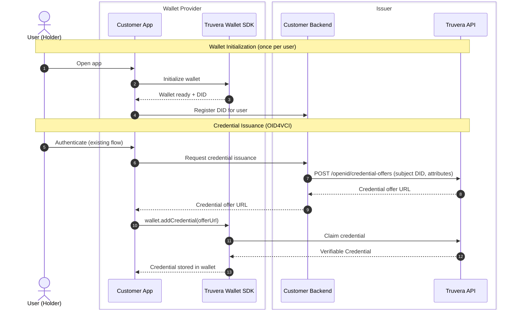
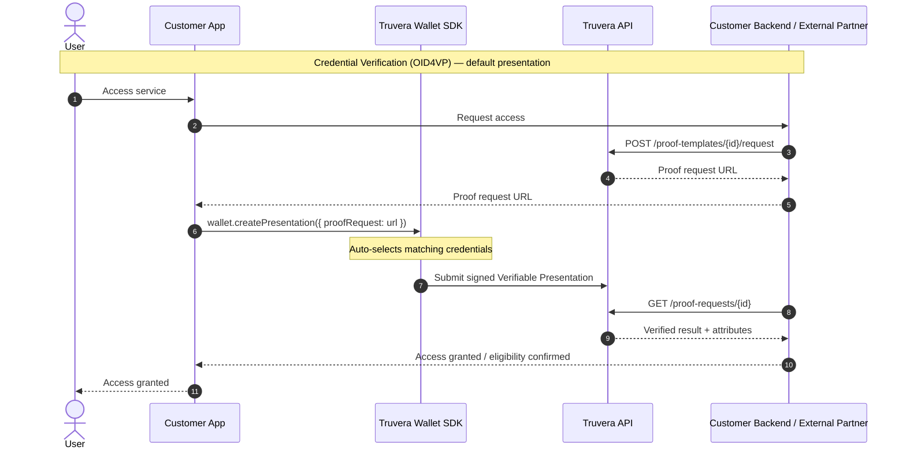

# Truvera Web Wallet integration guide

A concise reference for integrating Truvera into your application. For the full end-to-end flow, see the companion sequence diagram.

**SDK:** [`@docknetwork/wallet-sdk-web`](https://www.npmjs.com/package/@docknetwork/wallet-sdk-web)
---

## Architecture

Four components are involved in every integration:

| Actor | Role |
|---|---|
| **Holder** | The credential holder obtains credentials from an issuer, stores those credentials in a individually controlled web wallet, and uses the credentials to establish a trusted relationship with a verifier |
| **Wallet Provider** | The wallet provider is trusted by the holders to give them access to a web wallet |
| **Issuer** | The holder identity proofs with the credential issuer before receiving credentials. If the holder does not yet have a wallet, the issuer helps them set one up with the wallet provider. |
| **Verifer** | The verifier requests credentials from the holder in order to obtain trusted data that will allow the holder to complete a business process |






---

## 1. Wallet Initialization

This creates a DID that acts as the user's persistent identity handle. The SDK supports three key management methods — choose one based on your requirements.

### Recommended: passkey (WebAuthn PRF)

The simplest and most secure option. No mnemonic to manage. Keys are derived from the user's device authenticator (fingerprint, Face ID, PIN) via the WebAuthn PRF extension and never leave the browser.

```ts
const wallet = await TruveraWebWallet.initialize({
  edvUrl: 'https://edv.dock.io',
  edvAuthKey: '<your-auth-key>',
  networkId: 'testnet',
  passkey: true,
});

// On first enrollment only — prompt the user to save their recovery phrase
if (wallet.mnemonic) {
  showRecoveryPhraseDialog(wallet.mnemonic);
}
```

On first use, the SDK registers a passkey, derives key material via PRF, generates and encrypts a master key, and stores it in the cloud vault. On return visits, it authenticates with a single biometric prompt. Passkeys sync automatically across devices via iCloud Keychain (Apple) or Google Password Manager (Android/Chrome).

**Browser support:** Chrome 116+, Safari 18+, Edge 116+.

### Alternative: mnemonic

Use for backup/recovery flows or environments where passkeys are not supported.

```ts
// Generate once and prompt the user to save it
const { mnemonic } = await TruveraWebWallet.generateCloudWalletMasterKey();

const wallet = await TruveraWebWallet.initialize({
  edvUrl: 'https://edv.dock.io',
  edvAuthKey: '<your-auth-key>',
  networkId: 'testnet',
  mnemonic,
});
```

Never store the mnemonic in localStorage, a database, or anywhere server-side. The user is the only custodian.

### Alternative: master key

For advanced integrations where key management is handled externally (e.g. HSM or server-side key release after authentication).

```ts
const wallet = await TruveraWebWallet.initialize({
  edvUrl: 'https://edv.dock.io',
  edvAuthKey: '<your-auth-key>',
  networkId: 'testnet',
  masterKey: '<32-byte-key>',
});
```

---

After initialization, register the user's DID with your backend:

```ts
const did = await wallet.getDID();
// Store this DID against the user's account — it is the subject identifier for credential issuance
```

---

## 2. Credential Issuance (OID4VCI)

Your backend creates a credential offer using data attributes from your existing systems (e.g. KYC, CRM, HR). The wallet then claims it directly from Truvera.

**Backend — create the offer:**

```http
POST https://api.truvera.io/openid/issuers
{
  "algorithm": "bbdt16",
  "issuer": "<your-issuer-did>",
  "context": ["<your-credential-schema-url>"],
  "subject": {
    "id": "<user-did>",
    "fullName": "...",
    "dateOfBirth": "...",
    ...
  }
}

POST https://api.truvera.io/openid/credential-offers
→ { "offerUrl": "openid-credential-offer://..." }
```

Return the `offerUrl` to the app.

**App — claim the credential:**

```ts
await wallet.addCredential(offerUrl);
// Credential is now stored in the wallet
```

---

## 3. Credential Verification (OID4VP)

Verification works in three steps: create a proof template (once), generate a proof request from it (per verification), and poll for the result after the user submits their presentation.

### Step 1: Create a proof template (one-time setup)

A proof template defines what credentials and attributes you want to verify — the credential type, which fields to request, and any constraints (e.g. age predicates). For most use cases you create this once and reuse it for every verification request.

See the [Truvera API proof templates docs](https://docs.truvera.io/truvera-api/presentations/proof-templates) for the full schema and options.

### Step 2: Generate a proof request

Each time a user needs to verify, your backend generates a proof request from the template. This produces a short-lived request URL you pass to the app.

**Backend:**

```http
POST https://api.truvera.io/proof-templates/{templateId}/request
→ { "id": "...", "url": "..." }
```

Return the proof request URL to the app.

### Step 3: Build and submit the presentation

When called without credentials, the SDK automatically selects the best matching credentials from the wallet.

**App:**

```ts
// Using a proof request URL
const result = await wallet.createPresentation({
  proofRequest: 'https://creds-staging.truvera.io/proof/77ae2c67-678e-4cb6-8c5d-a4dd4a1a19f1'
});

// Or using a proof request object
const result = await wallet.createPresentation({
  proofRequest: proofRequestObject,
});

// Inspect the presentation
console.log(result.presentation);

// Submit when ready
const response = await result.submit();
```

### Step 4: Poll for the result

**Backend:**

```http
GET https://api.truvera.io/proof-requests/{id}
→ { "verified": true, "attributes": { ... } }
```

Grant or deny access based on `verified`.

---

## 4. Selective Disclosure

Only fields listed in `attributesToReveal` are shared with the verifier — including ones constrained by a ZK predicate (e.g. age >= 18). The verifier-side template decides whether each listed attribute is revealed in the clear or proven via a BBS+ predicate;

```ts
credentials: [
  {
    id: credential.id,
    attributesToReveal: ['credentialSubject.age', 'credentialSubject.address'],
  }
]
```

Use `dockbbs` (BBS+) as the algorithm when creating issuers if selective disclosure or ZK predicates are required.

---

## 5. Production Checklist

| Area | Requirement |
|---|---|
| **Key management** | Use passkey (`passkey: true`) as the default. Mnemonic and master key are for recovery or advanced cases only |
| **Mnemonic backup** | If using mnemonic, prompt the user to save it on first enrollment. Never store it server-side or in localStorage |
| **EDV auth key** | Contact support@dock.io to obtain your EDV auth key|
| **API key security** | Keep `TRUVERA_API_KEY` server-side only. Never expose to the client |
| **Backend auth** | Scope all issuance endpoints to authenticated users. Enforce JWT verification |
| **Revocation** | Check `credentialStatus` on every presentation before granting access |
| **Per-user scoping** | Each user needs their own DID and credential store. Never share wallet state across users |
