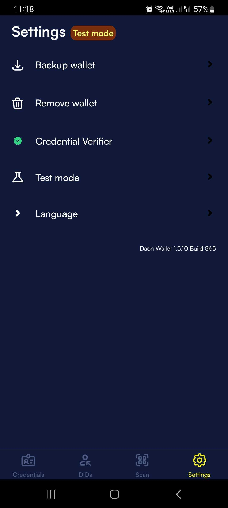

# Wallet backup

### Creating a backup

1. Open your Truvera wallet
2. Navigate to **Settings**
3. Select **Backup wallet**
4. Create and enter a secure password when prompted
5. The wallet will generate and download a JSON backup file to your device

<figure><figcaption></figcaption></figure>

### Restoring from backup

When setting up a new Truvera wallet:

1. During the wallet creation process, choose the option to import from backup
2. Select your previously downloaded JSON backup file
3. Enter the password you created during the backup process
4. Your wallet will be restored with all previous data

### Important notes

* Store your backup file in a secure location
* Keep your backup password safe and separate from the backup file
* Consider creating multiple backup copies stored in different secure locations
* Test your backup by attempting a restore on a secondary device to ensure it works properly
