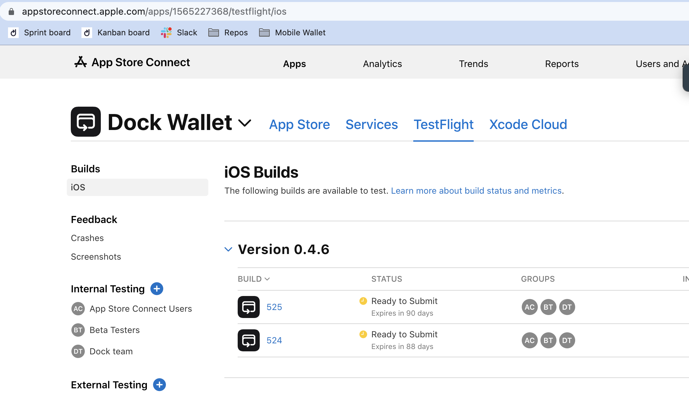
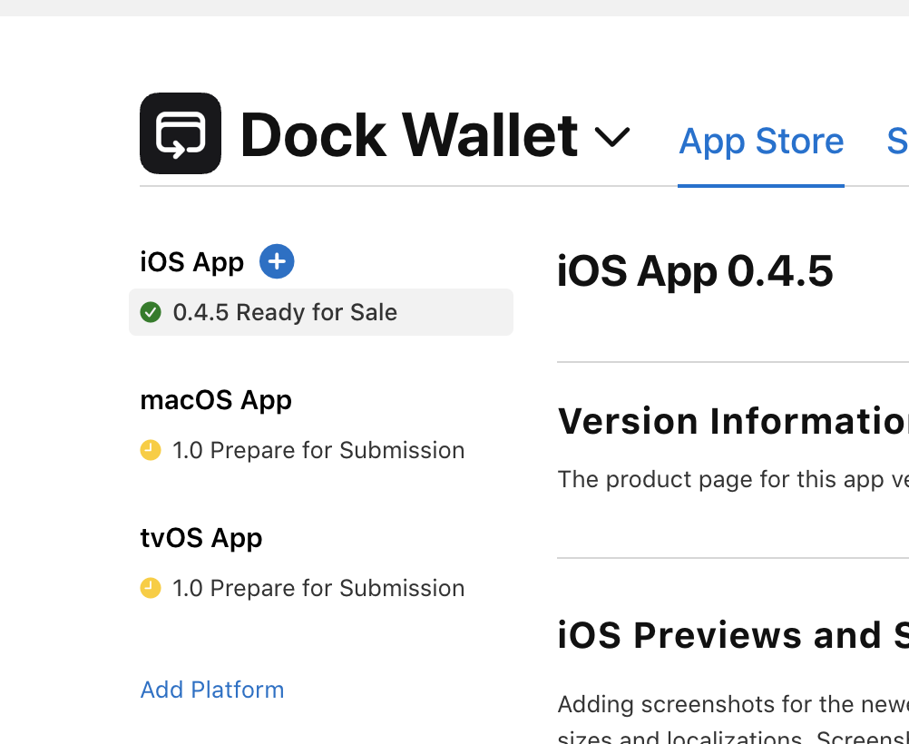
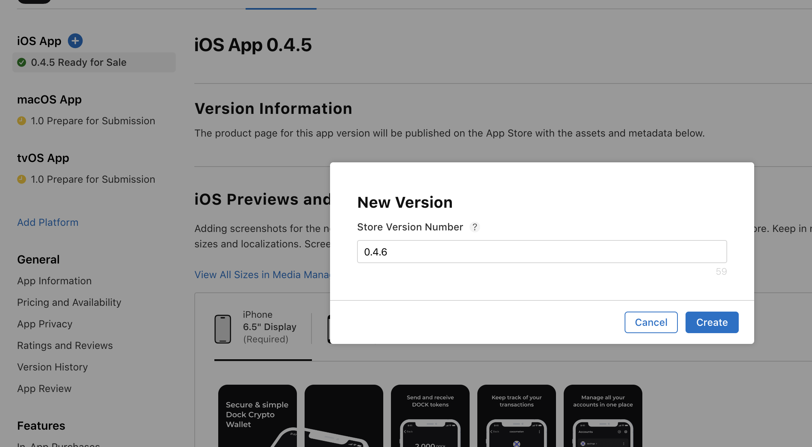
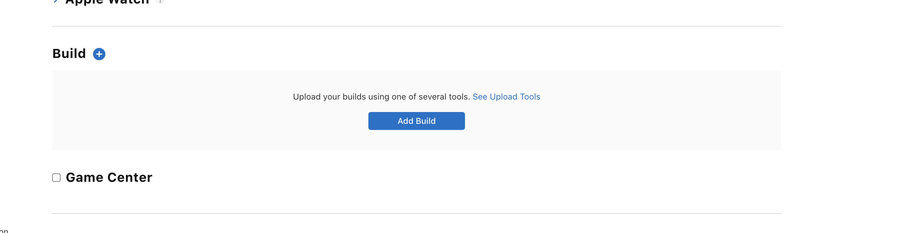

# iOS Build Testing and Publishing

## Configuration phase

1. When the customizations are done and repository updated create a Pull Request (PR)
2. Truvera will review and merge the PR into the master branch. That will trigger a new build. This will usually take \~1 business day.
3. A new release will be created in the distribution repository

* release name will be: wallet-version + wallet-build-number e.g: **v0.4.5\_build-523**
* If only minor changes are made on the whitelabel wallet they will be uploaded to an existing release instead of creating a new one to keep consistency with the Truvera Wallet.

4. Assets will be uploaded to the release in the ../releases

## Testing phase

1. Download the .ipa from the Github release
2.  Upload the .ipa to App Store Connect (Testflight)

    * A developer will need to run the following command line to upload the .ipa to Testfilight

    ```
    xcrun altool --upload-app -f ./DockApp.ipa -t ios -u "app-store-connect@email.com" --verbose
    ```

    * Once the upload finished, the app will be available in the Testflight UI iOS builds

    <div align="left"><figure><figcaption></figcaption></figure></div>
3. Add internal testers in Testflight
4. Testers will need to install Testflight, and accept an invitation sent via email
5. The app will be available in Testflight for testing. [More details from Apple](https://testflight.apple.com/)

## Publishing phase

1. Navigate to the App Store connect
2. Add new iOS App

<div align="left"><figure><figcaption></figcaption></figure></div>

3. Set the version number. Make sure to match the version number to the wallet version number e.g. **0.4.5**

<figure><figcaption></figcaption></figure>

ℹ️ To ease the review process we suggest adding a comment in the App Review section:

_To import an existing wallet you can use the json file provided. First need to unzip the file and select the json in the wallet, the password is !@1Dock321_

To get a json of your wallet, Install the wallet .apk on an Android phone -> Import a credential -> Generate a wallet backup using the password provided

4. Navigate to the Build section, and click on add build. Make sure to select the build number that was tested

<figure><figcaption></figcaption></figure>

5. Save, and add the app to review
