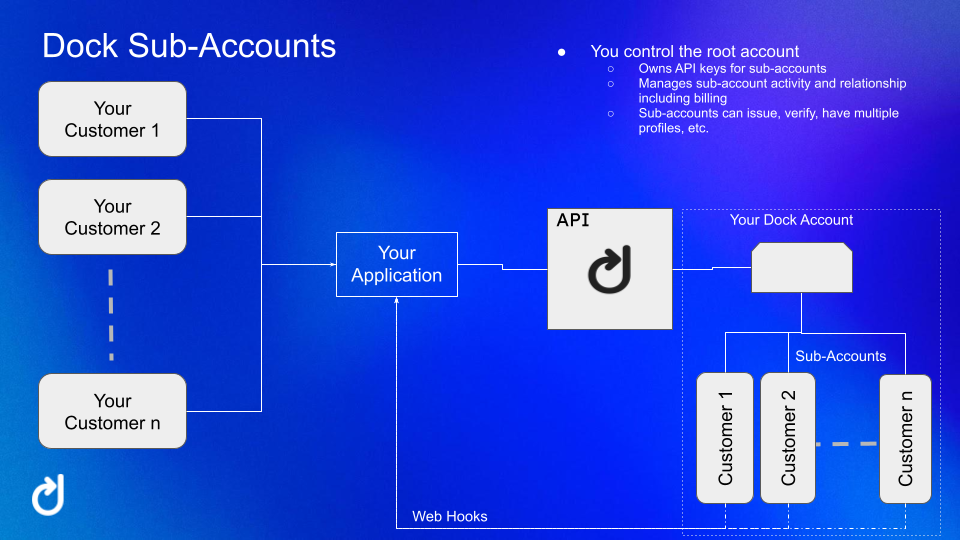

# Sub-Accounts

Sub-accounts are a feature of the Dock Certs API that allows Dock enterprise customers to segregate their data within Dock's platform based on their own customers. Each sub-account can have its own keys, organization profiles, credential designs and verification templates conviently organized to help with tracking and auditing of the activity performed by each.

When using a sub-account the root account can set up separate API keys for each sub-account. By using the sub-account specific API key it will ensure all the transactions are attributed to that sub-account.

<figure><figcaption></figcaption></figure>

## Create Sub-Account

### Parameters <a href="#post__subaccounts-parameters" id="post__subaccounts-parameters"></a>

<table data-full-width="false"><thead><tr><th width="120">Name</th><th width="104">In</th><th width="116">Type</th><th width="123">Required</th><th>Description</th></tr></thead><tbody><tr><td>body</td><td>body</td><td>object</td><td>true</td><td>Subaccount object</td></tr><tr><td>» name</td><td>body</td><td>string</td><td>true</td><td>The sub account name</td></tr><tr><td>» image</td><td>body</td><td>string</td><td>false</td><td>The sub account image</td></tr></tbody></table>

### Responses <a href="#post__subaccounts-responses" id="post__subaccounts-responses"></a>

<table data-full-width="false"><thead><tr><th width="134">Status</th><th width="185">Meaning</th><th width="228">Description</th><th>Schema</th></tr></thead><tbody><tr><td>200</td><td><a href="https://tools.ietf.org/html/rfc7231#section-6.3.1">OK</a></td><td>Subaccount has been created</td><td><a href="index.html.md#schemasubaccount">Subaccount</a></td></tr><tr><td>400</td><td><a href="https://tools.ietf.org/html/rfc7231#section-6.5.1">Bad Request</a></td><td>Error creating subaccount</td><td><a href="index.html.md#schemaerror">Error</a></td></tr><tr><td>402</td><td><a href="https://tools.ietf.org/html/rfc7231#section-6.5.2">Payment Required</a></td><td>Transaction limit reached or upgrade required to proceed</td><td><a href="index.html.md#schemaerror">Error</a></td></tr></tbody></table>

<details>

<summary>POST /subaccounts REQUEST CURL</summary>

```bash
curl -X POST https://api-testnet.dock.io/subaccounts \
  -H 'Content-Type: application/json' \
  -H 'Accept: application/json' \
  -H 'DOCK-API-TOKEN: API_KEY'

```

</details>

<details>

<summary>Body parameter</summary>

```json
{
  "name": "string",
  "image": "string"
}
```

</details>

<details>

<summary>200 Response</summary>

```json
{
  "id": 0,
  "name": "string",
  "email": "string",
  "image": "string"
}
```

</details>

## List Sub-Accounts

### Parameters <a href="#get__subaccounts-parameters" id="get__subaccounts-parameters"></a>

<table data-full-width="false"><thead><tr><th width="103">Name</th><th width="83">In</th><th width="148">Type</th><th width="108">Required</th><th>Description</th></tr></thead><tbody><tr><td>offset</td><td>query</td><td>integer(int32)</td><td>false</td><td>How many items to offset by for pagination</td></tr><tr><td>limit</td><td>query</td><td>integer(int32)</td><td>false</td><td>How many items to return at one time (max 64)</td></tr></tbody></table>

### Responses <a href="#get__subaccounts-responses" id="get__subaccounts-responses"></a>

<table data-full-width="false"><thead><tr><th width="108">Status</th><th width="117">Meaning</th><th width="290">Description</th><th>Schema</th></tr></thead><tbody><tr><td>200</td><td><a href="https://tools.ietf.org/html/rfc7231#section-6.3.1">OK</a></td><td>A paged array of subaccounts</td><td><a href="index.html.md#schemasubaccounts">Subaccounts</a></td></tr></tbody></table>

<details>

<summary>GET /subaccounts REQUEST CURL</summary>

```bash

curl -X GET https://api-testnet.dock.io/subaccounts \
  -H 'Accept: application/json' \
  -H 'DOCK-API-TOKEN: API_KEY'

```

</details>

<details>

<summary>200 Response</summary>

```json
[
  {
    "id": 0,
    "name": "string",
    "email": "string",
    "image": "string"
  }
]
```

</details>

## Get Sub-Account by ID

### Parameters <a href="#get__subaccounts_-id-parameters" id="get__subaccounts_-id-parameters"></a>

| Name | In   | Type   | Required | Description |
| ---- | ---- | ------ | -------- | ----------- |
| id   | path | string | true     | An ID       |

<details>

<summary>GET /subaccounts/{id} REQUEST CURL</summary>

```bash

curl -X GET https://api-testnet.dock.io/subaccounts/{id} \
  -H 'Accept: application/json' \
  -H 'DOCK-API-TOKEN: API_KEY'

```

</details>

<details>

<summary>200 Response</summary>

```json
{
  "id": 0,
  "name": "string",
  "email": "string",
  "image": "string"
}
```

</details>

### Responses <a href="#get__subaccounts_-id-responses" id="get__subaccounts_-id-responses"></a>

<table><thead><tr><th width="110">Status</th><th width="142">Meaning</th><th width="304">Description</th><th>Schema</th></tr></thead><tbody><tr><td>200</td><td><a href="https://tools.ietf.org/html/rfc7231#section-6.3.1">OK</a></td><td>Expected response to a valid request</td><td><a href="index.html.md#schemasubaccount">Subaccount</a></td></tr><tr><td>400</td><td><a href="https://tools.ietf.org/html/rfc7231#section-6.5.1">Bad Request</a></td><td>Error getting subaccount</td><td><a href="index.html.md#schemaerror">Error</a></td></tr><tr><td>401</td><td><a href="https://tools.ietf.org/html/rfc7235#section-3.1">Unauthorized</a></td><td>You do not own this subaccount</td><td><a href="index.html.md#schemaerror">Error</a></td></tr><tr><td>404</td><td><a href="https://tools.ietf.org/html/rfc7231#section-6.5.4">Not Found</a></td><td>Subaccount was not found</td><td><a href="index.html.md#schemaerror">Error</a></td></tr></tbody></table>

## Update the specified sub-account.

### Parameters <a href="#patch__subaccounts_-id-parameters" id="patch__subaccounts_-id-parameters"></a>

<table data-full-width="false"><thead><tr><th width="112">Name</th><th width="98">In</th><th width="107">Type</th><th width="126">Required</th><th>Description</th></tr></thead><tbody><tr><td>id</td><td>path</td><td>string</td><td>true</td><td>An ID</td></tr><tr><td>body</td><td>body</td><td>object</td><td>true</td><td>Subaccount properties</td></tr><tr><td>» name</td><td>body</td><td>string</td><td>true</td><td>The sub account name</td></tr><tr><td>» image</td><td>body</td><td>string</td><td>false</td><td>The sub account image</td></tr></tbody></table>

### Responses <a href="#patch__subaccounts_-id-responses" id="patch__subaccounts_-id-responses"></a>

<table data-full-width="false"><thead><tr><th width="124">Status</th><th width="177">Meaning</th><th width="257">Description</th><th>Schema</th></tr></thead><tbody><tr><td>200</td><td><a href="https://tools.ietf.org/html/rfc7231#section-6.3.1">OK</a></td><td>Subaccount has been updated</td><td><a href="index.html.md#schemasubaccount">Subaccount</a></td></tr><tr><td>400</td><td><a href="https://tools.ietf.org/html/rfc7231#section-6.5.1">Bad Request</a></td><td>Error creating subaccount</td><td><a href="index.html.md#schemaerror">Error</a></td></tr><tr><td>401</td><td><a href="https://tools.ietf.org/html/rfc7235#section-3.1">Unauthorized</a></td><td>You do not own this subaccount</td><td><a href="index.html.md#schemaerror">Error</a></td></tr><tr><td>402</td><td><a href="https://tools.ietf.org/html/rfc7231#section-6.5.2">Payment Required</a></td><td>Transaction limit reached or upgrade required to proceed</td><td><a href="index.html.md#schemaerror">Error</a></td></tr></tbody></table>

<details>

<summary>PATCH /subaccounts/{id} REQUEST CURL</summary>

```bash
curl -X PATCH https://api-testnet.dock.io/subaccounts/{id} \
  -H 'Content-Type: application/json' \
  -H 'Accept: application/json' \
  -H 'DOCK-API-TOKEN: API_KEY'
```

</details>

<details>

<summary>Body parameter</summary>

```json
{
  "name": "string",
  "image": "string"
}
```

</details>

<details>

<summary>200 Response</summary>

```json
{
  "id": 0,
  "name": "string",
  "email": "string",
  "image": "string"
}
```

</details>

## Deletes the specified sub-account.

### Parameters <a href="#delete__subaccounts_-id-parameters" id="delete__subaccounts_-id-parameters"></a>

<table data-full-width="false"><thead><tr><th>Name</th><th>In</th><th>Type</th><th>Required</th><th>Description</th></tr></thead><tbody><tr><td>id</td><td>path</td><td>string</td><td>true</td><td>An ID</td></tr></tbody></table>

### Responses <a href="#delete__subaccounts_-id-responses" id="delete__subaccounts_-id-responses"></a>

<table data-full-width="false"><thead><tr><th width="107">Status</th><th width="157">Meaning</th><th width="303">Description</th><th>Schema</th></tr></thead><tbody><tr><td>200</td><td><a href="https://tools.ietf.org/html/rfc7231#section-6.3.1">OK</a></td><td>Subaccount deleted</td><td>None</td></tr><tr><td>400</td><td><a href="https://tools.ietf.org/html/rfc7231#section-6.5.1">Bad Request</a></td><td>Error deleting subaccount</td><td><a href="index.html.md#schemaerror">Error</a></td></tr><tr><td>401</td><td><a href="https://tools.ietf.org/html/rfc7235#section-3.1">Unauthorized</a></td><td>You do not own this subaccount</td><td><a href="index.html.md#schemaerror">Error</a></td></tr><tr><td>404</td><td><a href="https://tools.ietf.org/html/rfc7231#section-6.5.4">Not Found</a></td><td>Subaccount was not found</td><td><a href="index.html.md#schemaerror">Error</a></td></tr></tbody></table>

<details>

<summary>DELETE /subaccounts/{id} REQUEST CURL</summary>

```bash
curl -X DELETE https://api-testnet.dock.io/subaccounts/{id} \
  -H 'Accept: application/json' \
  -H 'DOCK-API-TOKEN: API_KEY'

```

</details>

<details>

<summary>400 Response</summary>

```json
{
  "status": 0,
  "type": "string",
  "message": "string"
}
```

</details>

## Get Sub-Account Usage

Get details about the activity that this sub-account has performed against the system.

### Parameters <a href="#get__subaccounts_-id-_usage-parameters" id="get__subaccounts_-id-_usage-parameters"></a>

<table data-full-width="false"><thead><tr><th width="131">Name</th><th width="107">In</th><th>Type</th><th width="114">Required</th><th>Description</th></tr></thead><tbody><tr><td>id</td><td>path</td><td>string</td><td>true</td><td>An ID</td></tr><tr><td>startTime</td><td>query</td><td>string(date-time)</td><td>false</td><td>Timestamp for the start of the range (ISO 8601)</td></tr><tr><td>endTime</td><td>query</td><td>string(date-time)</td><td>false</td><td>Timestamp for the end of the range (ISO 8601)</td></tr><tr><td>offset</td><td>query</td><td>integer(int32)</td><td>false</td><td>How many items to offset by for pagination</td></tr><tr><td>limit</td><td>query</td><td>integer(int32)</td><td>false</td><td>How many items to return at one time (max 64)</td></tr></tbody></table>

### Responses <a href="#get__subaccounts_-id-_usage-responses" id="get__subaccounts_-id-_usage-responses"></a>

<table data-full-width="false"><thead><tr><th width="117">Status</th><th width="140">Meaning</th><th width="289">Description</th><th>Schema</th></tr></thead><tbody><tr><td>200</td><td><a href="https://tools.ietf.org/html/rfc7231#section-6.3.1">OK</a></td><td>A paged array of subaccount transaction usage metadata</td><td><a href="index.html.md#schemaarrayresponse">ArrayResponse</a></td></tr><tr><td>401</td><td><a href="https://tools.ietf.org/html/rfc7235#section-3.1">Unauthorized</a></td><td>You do not own this subaccount</td><td><a href="index.html.md#schemaerror">Error</a></td></tr></tbody></table>

<details>

<summary>GET /subaccounts/{id}/usage REQUEST CURL</summary>

```bash
curl -X GET https://api-testnet.dock.io/subaccounts/{id}/usage \
  -H 'Accept: application/json' \
  -H 'DOCK-API-TOKEN: API_KEY'

```

</details>

<details>

<summary>200 Response</summary>

```
[
  {}
]
```

</details>

## Create Sub-Account API Key

Creates an API key for a subaccount. In order for activity to be associated with the given sub-account an API key needs to be created for that sub-account and then that key must be used for all transactions related to that sub-account.

### Parameters <a href="#post__subaccounts_-id-_keys-parameters" id="post__subaccounts_-id-_keys-parameters"></a>

<table data-full-width="false"><thead><tr><th width="121">Name</th><th width="95">In</th><th width="109">Type</th><th width="110">Required</th><th>Description</th></tr></thead><tbody><tr><td>id</td><td>path</td><td>string</td><td>true</td><td>An ID</td></tr><tr><td>body</td><td>body</td><td>object</td><td>false</td><td>Subaccount properties</td></tr></tbody></table>

### Responses <a href="#post__subaccounts_-id-_keys-responses" id="post__subaccounts_-id-_keys-responses"></a>

<table data-full-width="false"><thead><tr><th width="109">Status</th><th width="180">Meaning</th><th width="287">Description</th><th>Schema</th></tr></thead><tbody><tr><td>200</td><td><a href="https://tools.ietf.org/html/rfc7231#section-6.3.1">OK</a></td><td>Subaccount API key created</td><td><a href="index.html.md#schemaresponse">Response</a></td></tr><tr><td>400</td><td><a href="https://tools.ietf.org/html/rfc7231#section-6.5.1">Bad Request</a></td><td>Error creating subaccount API key</td><td><a href="index.html.md#schemaerror">Error</a></td></tr><tr><td>401</td><td><a href="https://tools.ietf.org/html/rfc7235#section-3.1">Unauthorized</a></td><td>You do not own this subaccount</td><td><a href="index.html.md#schemaerror">Error</a></td></tr><tr><td>402</td><td><a href="https://tools.ietf.org/html/rfc7231#section-6.5.2">Payment Required</a></td><td>Transaction limit reached or upgrade required to proceed</td><td><a href="index.html.md#schemaerror">Error</a></td></tr></tbody></table>

<details>

<summary>POST /subaccounts/{id}/keys REQUEST CURL</summary>

```bash

curl -X POST https://api-testnet.dock.io/subaccounts/{id}/keys \
  -H 'Content-Type: application/json' \
  -H 'Accept: application/json' \
  -H 'DOCK-API-TOKEN: API_KEY'
```

</details>

<details>

<summary>200 Response</summary>

```json
{
  "code": 0
}
```

</details>

## List Sub-Account API Keys

### Parameters <a href="#get__subaccounts_-id-_keys-parameters" id="get__subaccounts_-id-_keys-parameters"></a>

<table data-full-width="false"><thead><tr><th width="106">Name</th><th width="85">In</th><th width="143">Type</th><th width="113">Required</th><th>Description</th></tr></thead><tbody><tr><td>id</td><td>path</td><td>string</td><td>true</td><td>An ID</td></tr><tr><td>offset</td><td>query</td><td>integer(int32)</td><td>false</td><td>How many items to offset by for pagination</td></tr><tr><td>limit</td><td>query</td><td>integer(int32)</td><td>false</td><td>How many items to return at one time (max 64)</td></tr></tbody></table>

### Responses <a href="#get__subaccounts_-id-_keys-responses" id="get__subaccounts_-id-_keys-responses"></a>

<table data-full-width="false"><thead><tr><th width="121">Status</th><th width="148">Meaning</th><th width="263">Description</th><th>Schema</th></tr></thead><tbody><tr><td>200</td><td><a href="https://tools.ietf.org/html/rfc7231#section-6.3.1">OK</a></td><td>A paged array of subaccount key metadata</td><td><a href="index.html.md#schemaarrayresponse">ArrayResponse</a></td></tr><tr><td>401</td><td><a href="https://tools.ietf.org/html/rfc7235#section-3.1">Unauthorized</a></td><td>You do not own this subaccount</td><td><a href="index.html.md#schemaerror">Error</a></td></tr></tbody></table>

<details>

<summary>GET /subaccounts/{id}/keys REQUEST CURL</summary>

```bash
curl -X GET https://api-testnet.dock.io/subaccounts/{id}/keys \
  -H 'Accept: application/json' \
  -H 'DOCK-API-TOKEN: API_KEY'
```

</details>

<details>

<summary>200 Response</summary>

```json
[
  {}
]
```

</details>

## Delete a Sub-Account API Key

Delete the specified API key for the given sub-account.

### Parameters <a href="#delete__subaccounts_-id-_keys_-keyid-parameters" id="delete__subaccounts_-id-_keys_-keyid-parameters"></a>

<table data-full-width="false"><thead><tr><th width="100">Name</th><th>In</th><th>Type</th><th>Required</th><th>Description</th></tr></thead><tbody><tr><td>id</td><td>path</td><td>string</td><td>true</td><td>An ID</td></tr><tr><td>keyId</td><td>path</td><td>string</td><td>true</td><td>An API key ID</td></tr></tbody></table>

### Responses <a href="#delete__subaccounts_-id-_keys_-keyid-responses" id="delete__subaccounts_-id-_keys_-keyid-responses"></a>

<table data-full-width="false"><thead><tr><th width="116">Status</th><th width="137">Meaning</th><th width="318">Description</th><th>Schema</th></tr></thead><tbody><tr><td>200</td><td><a href="https://tools.ietf.org/html/rfc7231#section-6.3.1">OK</a></td><td>Subaccount API key deleted</td><td>None</td></tr><tr><td>400</td><td><a href="https://tools.ietf.org/html/rfc7231#section-6.5.1">Bad Request</a></td><td>Error deleting subaccount API key</td><td><a href="index.html.md#schemaerror">Error</a></td></tr><tr><td>401</td><td><a href="https://tools.ietf.org/html/rfc7235#section-3.1">Unauthorized</a></td><td>You do not own this subaccount</td><td><a href="index.html.md#schemaerror">Error</a></td></tr><tr><td>404</td><td><a href="https://tools.ietf.org/html/rfc7231#section-6.5.4">Not Found</a></td><td>Subaccount API key was not found</td><td><a href="index.html.md#schemaerror">Error</a></td></tr></tbody></table>

<details>

<summary>DELETE /subaccounts/{id}/keys/{keyId} REQUEST CURL</summary>

```bash
curl -X DELETE https://api-testnet.dock.io/subaccounts/{id}/keys/{keyId} \
  -H 'Accept: application/json' \
  -H 'DOCK-API-TOKEN: API_KEY'
```

</details>

<details>

<summary>400 Response</summary>

```json
{
  "status": 0,
  "type": "string",
  "message": "string"
}
```

</details>
