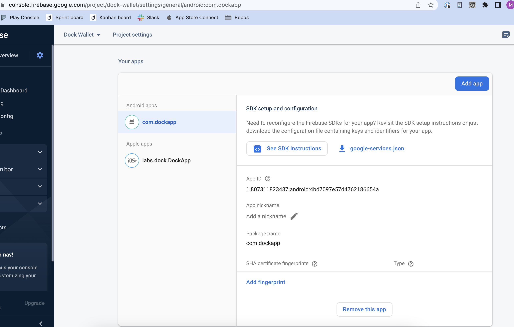

# Configuration

You will be invited to a dedicated Github repository, which will contain the files needed to customize, build and sign a white label build of the Dock Wallet to be distributed in the Apple and Google Play stores.

## General Setup

First clone the GitHub repository to add the source code to your machine.

<figure><figcaption></figcaption></figure>

Open the code editor and now you can go through the documentation in [README.md](http://readme.md/) and start making changes on the repository.

To make changes follow the instructions below and then submit a pull request (PR) to this repository to be reviewed by the Dock team. Once the changes are accepted a new release will be generated.

### Set the Application's Display Name & Package Id

First thing to do is setting the Application Display name and Package Id/Package Name.

:information\_source: _The package name uniquely identifies the app on the device; it is also unique in the Google Play store/ Apple App Store. This means that once you have published an app with this package name, you can never change it; doing so would cause your app to be treated as a brand new app, and existing users of your app will not see the newly packaged app as an update._

In ../app.json set the following fields

```
"displayName": <your application name>
"packageId": <your application package name>
"companyName": <your application package name>
"companyNamePossessive": <your application package name>

For example:
"name": "DockApp",
"displayName": "Cool Wallet",
"packageId": "com.coolwallet.app",
"companyName": "Cool",
"companyNamePossessive": "Cool's"
```

## Enabling and Disabling Features

The white label wallet can have a subset of the available features enabled.

To enable or disable a feature update the entries in the features\_config.json file

### Features you can enable or disable

* **Accounts**: The `Tokens` tab allows users to buy, send and receive Dock tokens. This tab will be hidden if this feature is disabled.
* **Credentials**: The `Credentials` tab will be hidden and no credentials will be able to be imported into the wallet if this feature is disabled.
* **DID Management**: Disabling this feature will mean that the user can not add or delete Decentralized Identifiers (DIDs). The `DIDs` tab is controlled by this feature flag.
* **Credential Verifier**: Allows the user to act as a Verifier and initiate verification flows from their device
* **Credential URLs**: Detects URLs in credential details. It allows users to click the detected links which are then opened in a browser on the user's device.

## Customizing the Styling

The files placed in the `src` file tree will replace files during the build in the `dock-app` repo. This allows the white label build to have custom colors and styling.

### Theme

The app theme can be customized using the values in the ../src/design-system/theme.js file. The javascript file contains three customizable variables:

* `Theme`: Contains the following variables:
  * `borderRadius` determines the radius of some card-like elements, e.g Modals.
  * `touchOpacity` the opacity of pressable items that should indicate pressed state
* `COLORS`: Determines the color scheme of the entire application. It uses a color pallet system (You can generate a color pallet using any of the tools like [JSON Color Palette Generator](https://json-color-palette-generator.vercel.app/), [Smart Swatch](https://smart-swatch.netlify.app/), or [Palx](https://palx.jxnblk.com/)). This section contains the following main colors:
  * `primary`: primary brand color pallet.
  * `primaryButton`: range `200-600` pallet for primary button phases (disabled, pressed, etc.) and a `text` value to set the color of the primary button text.
  * `secondaryButton`: range `200-600` pallet for secondary button phases (disabled, pressed, etc.) and a `text` value to set the color of secondary button texts.
  * `secondary`: with only 400 and 600 values in the pallet, they is used as accent backgrounds in sections of the application. To maintain contrast in values are recommended to be dark colored for dark themed customization and light for light themed customization.
  * `neutral`: a pallet for background and text colors. Contrast between 1 and 900 should be as much as possible, with light theme ranging from very dark(e.g {1: "black"}) to very light (e.g {900: "white}) and dark theme ranging the opposite way
  * `orange`: test mode indicator background and text colors
  * `teal`: validity inidicator colors
  * `blue`: used once for information box background.
  * `warning`: pending state indicator color
  * `error`: error state indicotor pallet
  * `backdrop`: used for modal backdrop transparency (dark)
  * `whiteBackdrop`: used for modal backdrop transparency (light)
  * `warningBg`: warning box background
* `baseTheme`: This should require no much changes. However if there is a need to change the style for specific components, this can be updated based on [nativebase guideline](https://docs.nativebase.io/customizing-components).

[See examples of white labeled wallet designs](https://www.figma.com/file/hpHhkjv6tz3KdlSX8Hr1tH/White-label-wallet-\(Copy\)?type=design\&node-id=8-175\&mode=design)

### Images

The app icon and the splash screen logo can be customized on the app.

**TIP** You can use tools like https://www.appicon.co to auto-size your images to the appropriate sizes.

#### Updating the Splash Screen Logo&#x20;

There are two logos with sizes variations available for customization, they need to be replaced in the following folders.


&#x20;**Please ensure that the image width matches while allowing the height to be flexible. Avoid adding empty margins to fill the remaining height.**


| Icon Size | Example                                           | Icon Size | Example                                               |
| --------- | ------------------------------------------------- | --------- | ----------------------------------------------------- |
| 382 x 128 |                | 318 x 72  |  (1).png>) |
| 850 x 192 |         | 425 x 96  | .png>)     |
| 212 x 48  |        | 637 x 144 | .png>)     |
| 212 x 48  | .png>) | 850 x 192 | .png>)     |

#### Updating the App Icon&#x20;

The app icon should be a `.png` file and needs to be replaced with your custom app icon in these sizes.

| Android icon size | Example                                           | iOS icon size | Example                                                |
| ----------------- | ------------------------------------------------- | ------------- | ------------------------------------------------------ |
| 120 x 120         |                | 40 x 40       |                       |
| 48 x 48           |        | 58 x 58       |                       |
| 72 x 72           | .png>) | 60 x 60       |                       |
| 96 x 96           | .png>) | 80 x 80       |                       |
| 144 x 144         | .png>) | 87 x 87       |                       |
| 192 x 192         | .png>) | 120 x 120     |                      |
|                   |                                                   | 180 x 180     |                      |
|                   |                                                   | 1024 x 1024   |  |


## Configuring for Android Builds

In order to generate the needed files and publish the wallet to the Google Play Store several configuration steps are needed.

### Enable the Android build

We allow white labeling both Android and iOS applications, but we suggest doing them one by one to make the PR review easier.

In the ../build-config.json file set `build-android: true`.

### Setup App in Google Play Console

1. Log in or sign up for a [Google Android Developer account](https://play.google.com/console)
2. Create your new app (instructions from [Google's Help Center](https://support.google.com/googleplay/android-developer/answer/9859152?hl=en))

### Setup App in Firebase

1. Sign up for a [Firebase account](https://console.firebase.google.com) Note: Android and iOS apps can share the same Firebase account
2. Register your app as an Android app (instructions from [Firebase's Help Center](https://firebase.google.com/docs/android/setup?authuser=0\&hl=en))


Use the same package name that you have defined in the General Setup step.


&#x20;

<figure><figcaption></figcaption></figure>

3. Go to Project Settings and download the `google-services.json` file

<figure><figcaption></figcaption></figure>

3. Replace the `google-services.json` file in ../android/app/src/google-services.json

### Modify Strings

1. Update the `app_name` setting in ../android/app/src/main/res/values/strings.xml with the name of your app.

### Generate Android Certificates

Android requires that all apps be digitally signed with a certificate before they can be installed. In order to distribute your Android application via Google Play store it needs to be signed with a release key that then needs to be used for all future updates.

You can generate the certificate using the commands below.

```
# Generate the certificate using keytool. You need to have Java JDK installed https://reactnative.dev/docs/signed-apk-android
# IMPORTANT: This is a interactive cli, and will ask you to provide a password to encrypt the certificate
# IMPORTANT: Do not rename the files
# Make sure to save this password, it will be needed later on
sudo keytool -genkey -v -keystore ../android-release.keystore -alias key0 -keyalg RSA -keysize 2048 -validity 10000
```

This command will replace the `../android-release.keystore` file.

Update the ../packaging.config file using the password created while generating the certificate.

## RELEASE\_STORE\_PASSWORD=

## RELEASE\_KEY\_PASSWORD=

## Configuring iOS Builds

In order to generate the needed files to publish the wallet to the Apple Store several configuration steps are needed. You can read about getting started with iOS apps [here](https://www.kodeco.com/books/ios-app-distribution-best-practices/v1.0.ea1/chapters/2-your-first-app-in-the-app-store).

### Enable the iOS build

In the ../build-config.json file set `build-ios: true`.

### Setup App

1. Sign up for an [Apple Developer account](https://developer.apple.com)
2. Create your new app [in App Store Connect](https://appstoreconnect.apple.com/)

### Register an App ID

1. Go to [Identifiers](https://developer.apple.com/account/resources/identifiers)
2. Click on the (+) to add a new Identifier
3. Select `App Ids` and click Continue
4. Select `App` and click Continue
5. Enable the following Capabilities
   * iCloud (include CloudKit support)
   * Push Notifications
   * Time Sensitive Notifications
6. Add a Bundle ID (for consistency use the same bundle ID that you used for Android)
7. Click on Continue
8. Click on Register

### Register an iCloud Container

1. Go to the [iCloud Containers](https://developer.apple.com/account/resources/identifiers/list/cloudContainer) list
2. If you don't have an iCloud container already registered click on the (+) to add one

<figure><figcaption></figcaption></figure>


&#x20;The identifier can look like iCloud.com.coolwallet


### Assign the iCloud Container to your App ID

1. Go to the [Identifiers](https://developer.apple.com/account/resources/identifiers) list
2. Select the App ID you created in the previous step
3. Scroll down to the iCloud capability
4. Click on the `Configure` (or `Edit`) button
5. Select your iCloud Container from the list and click Continue

### Configure Push Notifications for your App ID

1. Go to the [Identifiers](https://developer.apple.com/account/resources/identifiers) list
2. Select the App ID you created above
3. Scroll down to the Push Notifications capability
4. Click on `Configure`

_Note: any time you make a change to your App ID you need to re-run `fastlane match`. See instructions below._

### Setup Firebase for your app

1. Sign up for a [Firebase account](https://console.firebase.google.com). _Note: Android and iOS apps can share the same Firebase account_
2. Register your app as iOS app. _You can find your Bundle Identifier here: https://developer.apple.com/account/resources/identifiers/list_&#x20;

<figure><figcaption></figcaption></figure>

3. Upload Apple Push Notification certificates

* Go to `Project Settings` -> `Cloud Messaging`
* Scroll down to `Apple app configuration`
* Expand the `APNs Certificates` section
* Upload the Development and Production SSL certificates you created in the previous step

4. Go back to Project Settings -> Cloud Messaging and download the `GoogleService-Info.plist` file
5. Replace the `GoogleService-Info.plist` file in ../ios/GoogleService-Info.plist

### Generate Signing Certificates for iOS

iOS requires that all apps be digitally signed with a certificate before they can be installed. In order to distribute your iOS application via Testflight or App Store it needs to be signed with a release key that then needs to be used for all future updates.

To achieve this we are going to use [Fastlane actions](https://docs.fastlane.tools/actions/match/).

NOTE: This requires access to a computer running MacOS.

#### Using `fastlane match`

This command will generate all of your certificates and provisioning profiles needed to build and sign your applications. They are encrypted using OpenSSL via a passphrase.

Do not modify the files generated by this command, as they get overwritten every time you run _match_.

The files need to be placed in the following folders.

* ./certs

This directory contains all your certificates with their private keys

* profiles

This directory contains all the provisioning profiles

#### Installation

Make sure you have the latest version of the [Xcode](https://developer.apple.com/xcode/) command line tools installed:

```
xcode-select --install
```

Install _fastlane_ using

```
[sudo] gem install fastlane -NV
```

or alternatively using `brew install fastlane`

#### Usage

Navigate to your project folder and run

```
# use match to generate the certificates and push to this repo
# IMPORTANT: This is a interactive cli, and will ask you to provide a password to encrypt match certs
# Make sure to save this password, it will be needed later on
# NOTE: these commands assume a Git branch named "dev" is being used
fastlane match appstore --git_branch "dev" --skip_docs
fastlane match development --git_branch "dev" --skip_docs
```

#### Update packaging.config

Set the following values in the ../packaging.config file.

```
# MATCH_PASSWORD is the password you entered during the fastlane command
MATCH_PASSWORD=<use the same password you used running fastlane>
MATCH_REPOSITORY=<this repository name>
IOS_BUNDLE_ID=<generated on https://developer.apple.com/account/resources/identifiers/list>>
```

For more information see the [fastlane match git repo](https://docs.fastlane.tools/actions/match/)
