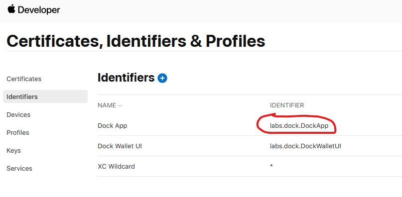

# Configuring iOS Builds

In order to generate the needed files to publish the wallet to the Apple Store several configuration steps are needed. You can read about getting started with iOS apps [here](https://www.kodeco.com/books/ios-app-distribution-best-practices/v1.0.ea1/chapters/2-your-first-app-in-the-app-store).

## Enable the iOS build

In the ../build-config.json file set `build-ios: true`.

## Setup App

1. Sign up for an [Apple Developer account](https://developer.apple.com)
2. Create your new app [in App Store Connect](https://appstoreconnect.apple.com/)

## Register an App ID

1. Go to [Identifiers](https://developer.apple.com/account/resources/identifiers)
2. Click on the (+) to add a new Identifier
3. Select `App Ids` and click Continue
4. Select `App` and click Continue
5. Enable the following Capabilities
   * iCloud (include CloudKit support)
   * Push Notifications
   * Time Sensitive Notifications
6. Add a Bundle ID (for consistency use the same bundle ID that you used for Android)
7. Click on Continue
8. Click on Register

## Register an iCloud Container

1. Go to the [iCloud Containers](https://developer.apple.com/account/resources/identifiers/list/cloudContainer) list
2. If you don't have an iCloud container already registered click on the (+) to add one

<figure><figcaption></figcaption></figure>


&#x20;The identifier can look like iCloud.com.coolwallet


## Assign the iCloud Container to your App ID

1. Go to the [Identifiers](https://developer.apple.com/account/resources/identifiers) list
2. Select the App ID you created in the previous step
3. Scroll down to the iCloud capability
4. Click on the `Configure` (or `Edit`) button
5. Select your iCloud Container from the list and click Continue

## Configure Push Notifications for your App ID

1. Go to the [Identifiers](https://developer.apple.com/account/resources/identifiers) list
2. Select the App ID you created above
3. Scroll down to the Push Notifications capability
4. Click on `Configure`

_Note: any time you make a change to your App ID you need to re-run `fastlane match`. See instructions below._

## Setup Firebase for your app

1. Sign up for a [Firebase account](https://console.firebase.google.com). _Note: Android and iOS apps can share the same Firebase account_
2. Register your app as iOS app. _You can find your Bundle Identifier here: https://developer.apple.com/account/resources/identifiers/list_&#x20;

<figure><figcaption></figcaption></figure>

3. Upload Apple Push Notification certificates

* Go to `Project Settings` -> `Cloud Messaging`
* Scroll down to `Apple app configuration`
* Expand the `APNs Certificates` section
* Upload the Development and Production SSL certificates you created in the previous step

4. Go back to Project Settings -> Cloud Messaging and download the `GoogleService-Info.plist` file
5. Replace the `GoogleService-Info.plist` file in ../ios/GoogleService-Info.plist

## Generate Signing Certificates for iOS

iOS requires that all apps be digitally signed with a certificate before they can be installed. In order to distribute your iOS application via Testflight or App Store it needs to be signed with a release key that then needs to be used for all future updates.

To achieve this we are going to use [Fastlane actions](https://docs.fastlane.tools/actions/match/).

NOTE: This requires access to a computer running MacOS.

#### Using `fastlane match`

This command will generate all of your certificates and provisioning profiles needed to build and sign your applications. They are encrypted using OpenSSL via a passphrase.

Do not modify the files generated by this command, as they get overwritten every time you run _match_.

The files need to be placed in the following folders.

* ./certs

This directory contains all your certificates with their private keys

* profiles

This directory contains all the provisioning profiles

#### Installation

Make sure you have the latest version of the [Xcode](https://developer.apple.com/xcode/) command line tools installed:

```
xcode-select --install
```

Install _fastlane_ using

```
[sudo] gem install fastlane -NV
```

or alternatively using `brew install fastlane`

#### Usage

Navigate to your project folder and run

```
# use match to generate the certificates and push to this repo
# IMPORTANT: This is a interactive cli, and will ask you to provide a password to encrypt match certs
# Make sure to save this password, it will be needed later on
# NOTE: these commands assume a Git branch named "dev" is being used
fastlane match appstore --git_branch "dev" --skip_docs
fastlane match development --git_branch "dev" --skip_docs
```

#### Update packaging.config

Set the following values in the ../packaging.config file.

```
# MATCH_PASSWORD is the password you entered during the fastlane command
MATCH_PASSWORD=<use the same password you used running fastlane>
MATCH_REPOSITORY=<this repository name>
IOS_BUNDLE_ID=<generated on https://developer.apple.com/account/resources/identifiers/list>>
```

For more information see the [fastlane match git repo](https://docs.fastlane.tools/actions/match/)
