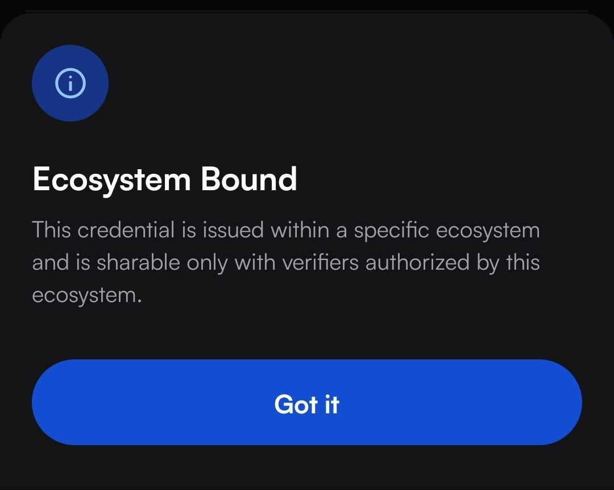

# Setting up monetizable credentials

This is a detailed guide on how to monetize your credentials using Dock.

### Creating an ecosystem

Verification fees can be set by Ecosystem administrators to the participants of an ecosystem. Verifiers will only be able to access a credential if they are in the same ecosystem with the Issuer.  See the step by step guide on [Ecosystem set up](../ecosystem-tools/ecosystem-set-up.md).&#x20;


Ecosystem administrators should only invite verifiers to an ecosystem with paid credentials if they have a billing relationship in place.


### Assigning schemas and adding verification prices

Verification prices are added to the schemas when assigning them to participants in the ecosystem.&#x20;

First a schema needs to be [created](../create-a-schema.md) and then [assigned to an ecosystem](https://docs.dock.io/dock-certs/ecosystem-tools/ecosystem-set-up#assign-credential-schemas).

<figure><figcaption></figcaption></figure>

Verification fee will be displayed to all ecosystem participants. Verification fee is displayed in USD, but ecosystem administrators can transact with their ecosystem participants in their preferred currency.&#x20;


Dock will charge a percentage of the Verification fee as a platform commission. For each verification where that commission is too low, we will charge a minimum platform fee.&#x20;


<figure><figcaption></figcaption></figure>


The systems supports tracking fees in fractions of a cent to six decimal places.


### Issueing credentials&#x20;

The process of issuing credentials will be the same. [See step by step instructions.](setting-up-verification-fees.md#issue-credentials)

The issuer will see a message showing that the credential can only be verified by participants of the specified ecosystem and requires a verification fee.&#x20;

<figure><figcaption></figcaption></figure>


Zero-Knowledge Proof type of credential is mandatory for paid verification and will be selected by default.


For the holders monetizable credentials will look almost the same as regular credentials, they will be able to see an Ecosystem Bound badge in the credential settings withthe explantion, that this credential was issued within a specific ecosystem and is sharable only with verifiers authorized by that ecosystem.

<figure><figcaption></figcaption></figure>

### Creating a verification template and assigning it

When [creating a verification template ](../verify-credentials.md)a message will be shown that there is a fee for verifying each credential using the selected schema.

<figure><figcaption></figcaption></figure>

[Verification templates need to be added to an ecosystem](https://docs.dock.io/dock-certs/ecosystem-tools/ecosystem-set-up#add-verification-templates) and will be visible for all participants.


Wallet-to-wallet verification is not supported by monetizable credentials.


### Choosing a DID for verification

When using a monetizable credential verification template verifier will be prompted to choose the verifiers DID. It has to be the same DID that is participating in the ecosystem.

<figure><figcaption></figcaption></figure>


When the holder has the same information in monetizable credentials from two different ecosystems, verification will default to the least expensive ecosystem.


### Getting the billing report&#x20;

All payments are  managed by the ecosystem administrator. Dock provides a billing report that can be downloaded by the ecosystem administrator.

<figure><figcaption></figcaption></figure>

Billing report data can be selected for a specific date range and will include information about the date of verification, schema that was verified, verification ID, DIDs of Issuer and Verifier, whether the verification was successful and verification and platform fees.

<figure><figcaption></figcaption></figure>

Billing report includes all verifications where a credential was submited for verification e.g if a verification request was made, but no credential was presented it will not be included, however if an invalid credential is presented and verification fails it will be included in the billing report.&#x20;


Ecosystem administrators take responsibility for charge-backs and disputes.&#x20;



Ecosystem administrators can remove ecosystem participants that do not meet ecosystem requirements.

