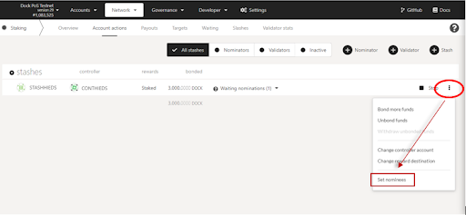

# How to redistribute stake to other validators

This article explains the process to redistribute stake after you have already staked on the network. A step-by-step process is provided for each scenario depending on if you are a validator (running a node) or staker (staking tokens on behalf of validators) in the Dock network.

There are two ways to redistribute stake by either 1) changing the selected validators or 2) unbonding funds and transferring to a different validator set.

### Option 1: Change validator selection

_**(nominators only)**_

1. Go to the [Account actions](https://fe.dock.io/#/staking/actions) page and select 3-dots for your nominator and select the “Set nominees” option.

<figure><figcaption></figcaption></figure>

2\. Then add or remove validators from the modal that appears.

<figure><figcaption></figcaption></figure>

### Option 2: Unbond and transfer stake to other validators

_**(stakers and validators)**_

1. Go to the [Account actions](https://fe.dock.io/#/staking/actions) page, select 3-dots for your stake and select the **Unbond funds** option.
2. On the modal that opens, select the amount you want to unbond. Note that it will take 7 days for the funds to unbond.\

<figure><figcaption></figcaption></figure>

3\. After 7 days, revisit this same page, select the 3-dots for your stake and select the **Withdraw unboned** option. If this option is disabled, then it means 7 full days have not yet passed.

<figure><figcaption></figcaption></figure>

**Tip:** Hover over the clock icon to see exactly how long until your stake will be unbonded as shown below.\

.png>)

\
\
4\. Withdraw the amount and transfer it to another of your stash accounts to stake a new set of validators. Each stash account can only stake for one set of validators.\


**Note to validators:** Redistributing your stake to other validators may affect your chances of being selected as a validator as other candidates may out-stake you for the validator spot.

