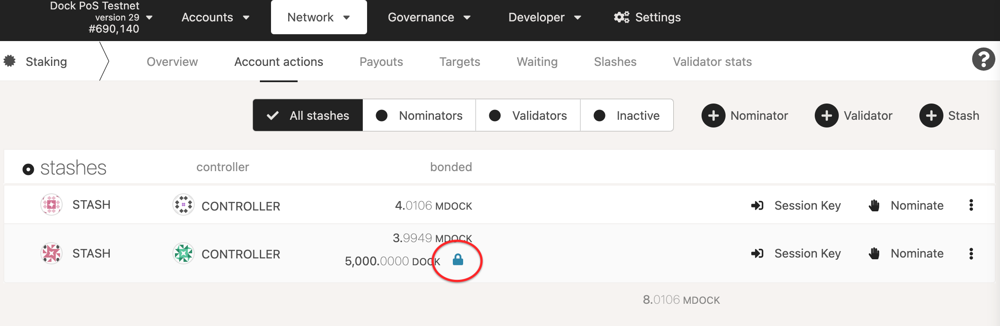

# How to unbond and rebond

The following describes how to stop nominating or validating and retrieve your tokens. Please note that all staking networks have a delayed exit period, called the unbonding period, which serves as a cooldown. You will not be able to transfer your tokens before this period has elapsed, and you will not receive any staking rewards during this period (as you are not nominating any validators). This period is 7 days on the Dock network.

### Step 1: Stop Nominating

On the [Dock-JS Apps](https://fe.dock.io/#/staking) navigate to the **Staking** tab and go to the on the [**Account Actions**](https://fe.dock.io/#/staking/actions) tab and click **Stop Nominating** or **Stop Validating** (depending on your role) on the account you'd like to stop nominating. This will "chill" the tokens.

### Step 2: Unbonding an amount

Your tokens will need to be unbonded in order to be able to withdraw from staking. To unbond the amount, click the three dots icon for the account you want to unbond tokens and select **Unbond funds**.

Enter the amount of tokens to unbond, click **Unbond**, and confirm the transaction.

If successful, your balance will show as "unbonding" with an indicator of how many more blocks remain until the amount is fully unlocked.

### 3. Withdraw unbonded tokens

You can check the amount of time remaining until you can withdraw your stake in the [Accounts](https://fe.dock.io/#/accounts) page by expanding your account balance. There is a tiny icon beside the word "unbonding" that will eventually become an unlock icon once your tokens are available to withdraw. Click that icon directly to submit the withdraw transaction which, once complete, will increase your transferable balance by the amount of tokens you've just fully unbonded.

<figure><figcaption></figcaption></figure>

## Rebonding before the end of the unbonding period

If you want to rebond your tokens before the unbonding period is over you can do this by issuing a rebond extrinsic. This allows you to bond your tokens that are still locked without waiting until the end of the unbonding period.

In order to do this you will need to manually issue an extrinsic by going to the [**Extrinsics**](https://fe.dock.io/#/extrinsics) section that's located in the **Developer** dropdown in the top menu. Enter the amount of tokens that are currently locked in unbonding that you want to rebond and click **Submit Transaction**.

Confirm the transaction in the next pop-up. Once the transaction is processed, your tokens will be rebonded again and you can start staking with them.
