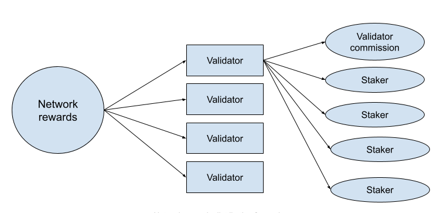

# What is the staking yield on Dock?

The Dock network utilizes a proof-of-stake consensus which enables token holders to stake Dock tokens and receive network rewards. The amount of rewards that a token holder can earn for staking depends on several factors:

* **Number of validators** - The network currently selects up to 50 validators concurrently participating in validating in an era (every 12 hours). The rewards for each era are distributed equally among each validator for participating in that era, which is split among the validator and the token holders that backed the validators.&#x20;
* **Validator commission rates** - Validators are able to set their own commission rates which are paid from the amount of emission rewards distributed to each validator. The commission rates for each validator can be viewed on the [Staking dashboard](https://fe.dock.io/#/staking).
* **Number of other token holders staking the same validators** - After a validator receives their commission, the remaining rewards are distributed proportionally to the token holders based on their amount of stake.&#x20;
* **Total network staked**  - The Dock network has an optimal staking rate of 40% of the total network staked and the amount of rewards adjusts to optimize towards that staking rate. This means the higher the % of the network staked, the higher the amount of rewards that will be distributed.
* **Rewards emission schedule** - The maximum amount of staking rewards distributed by the network changes annually based on the [emission reward schedule](../emission-rewards.md) which releases up to 25% of the remaining rewards each year.

<figure><figcaption></figcaption></figure>

### Network Returns

The total network returns can be viewed in the [Staking Dashboard](https://fe.dock.io/#/staking/targets) under the Targets tab. It’s important to remember that this will show the total rewards for the network and the amount of rewards an individual receives fluctuates based on the factors mentioned above.

### Adjusted yield

[Adjusted yield](https://www.investopedia.com/terms/i/inflation\_adjusted\_return.asp), also known as real yield, is the network annualized return rate adjusted by the network inflation supply.  Because the Dock network has a fixed supply of 1 billion tokens and a limited amount of tokens being released for validators staking, the inflation rate is very small at 1% and therefore the impact on yield is minor compared to most staking networks. This is a major benefit of the Dock network. Most other staking networks have much higher inflation with a growing supply, so the adjusted rewards are significantly lower than the rewards once inflation is taken into account.
