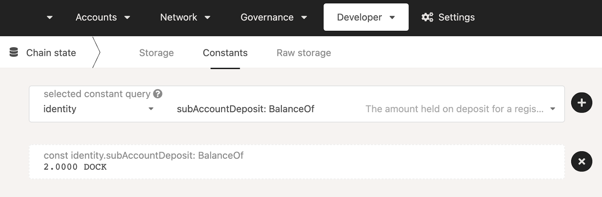

# Sub Identities

Users can also link accounts by setting "sub accounts", each with its own identity, under a primary account. The system reserves a bond for each sub account. An example of how you might use this would be a validation company running multiple validators. A single entity, "My Staking Company", could register multiple sub accounts that represent the stash accounts of each of their validators.

An account can have a maximum of 100 sub-accounts.

To register a sub-identity, go to the [Accounts Page](https://fe.dock.io/#/accounts), select the three dots to the right of the account to which you would like to add the sub-identity. Please note that the account needs to have an Identity registered in order to be able to add a sub-identity. Next, select Set on-chain sub-identities and then select one or more sub-identities. You can remove the sub-identities by following the same steps.

<figure><figcaption></figcaption></figure>


Make sure you have set your on-chain identity first before creating sub-identities.


Note that a deposit of 20.053 is required for every sub-account. You can use the [Chain States > Constants](https://fe.dock.io/#/chainstate/constants) page again to verify this amount by querying the identity.subAccountDeposit constant.

<figure><figcaption></figcaption></figure>
