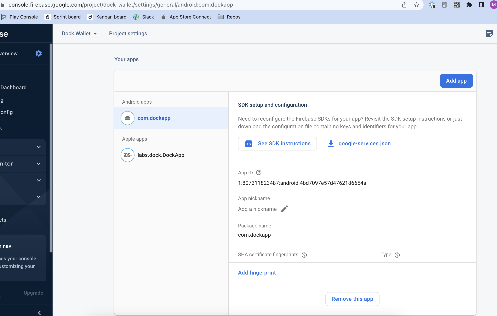

# Configuring for Android Builds

In order to generate the needed files and publish the wallet to the Google Play Store several configuration steps are needed.

## Enable the Android build

We allow white labeling both Android and iOS applications, but we suggest doing them one by one to make the PR review easier.

In the ../build-config.json file set `build-android: true`.

## Setup App in Google Play Console

1. Log in or sign up for a [Google Android Developer account](https://play.google.com/console)
2. Create your new app (instructions from [Google's Help Center](https://support.google.com/googleplay/android-developer/answer/9859152?hl=en))

## Setup App in Firebase

1. Sign up for a [Firebase account](https://console.firebase.google.com) Note: Android and iOS apps can share the same Firebase account
2. Register your app as an Android app (instructions from [Firebase's Help Center](https://firebase.google.com/docs/android/setup?authuser=0\&hl=en))


Use the same package name that you have defined in the General Setup step.


<figure><figcaption></figcaption></figure>

3. Go to Project Settings and download the `google-services.json` file

<figure><figcaption></figcaption></figure>

4. Replace the `google-services.json` file in ../android/app/src/google-services.json

## Modify Strings

Update the `app_name` setting in ../android/app/src/main/res/values/strings.xml with the name of your app.

## Generate Android Certificates

Android requires that all apps be digitally signed with a certificate before they can be installed. In order to distribute your Android application via Google Play store it needs to be signed with a release key that then needs to be used for all future updates.

You can generate the certificate using the commands below.

```
# Generate the certificate using keytool. You need to have Java JDK installed https://reactnative.dev/docs/signed-apk-android
# IMPORTANT: This is a interactive cli, and will ask you to provide a password to encrypt the certificate
# IMPORTANT: Do not rename the files
# Make sure to save this password, it will be needed later on
sudo keytool -genkey -v -keystore ../android-release.keystore -alias key0 -keyalg RSA -keysize 2048 -validity 10000
```

This command will replace the `../android-release.keystore` file.

Update the ../packaging.config file using the password created while generating the certificate.

RELEASE\_STORE\_PASSWORD=

RELEASE\_KEY\_PASSWORD=
