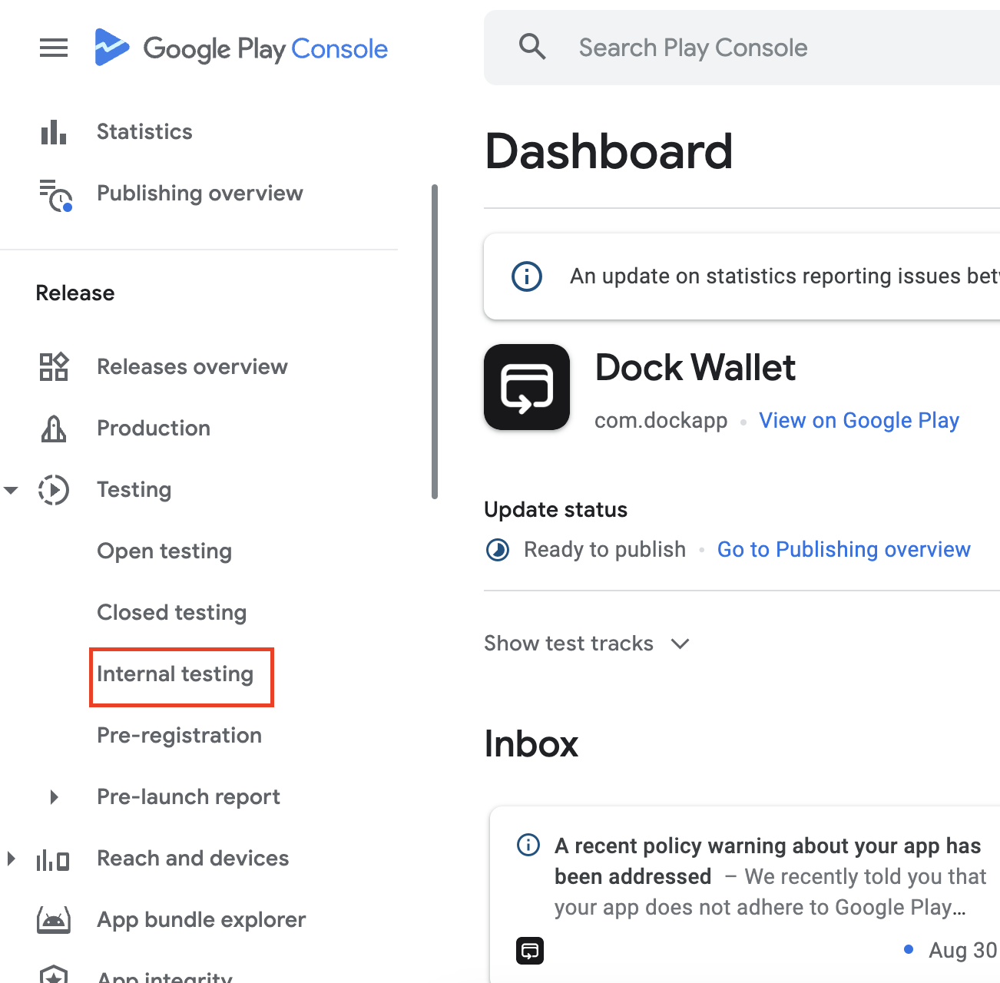

# Android Build Testing and Publishing

## Configuration phase

1. When the customizations are done and repository updated create a Pull Request (PR)
2. Dock will review and merge the PR into the master branch. That will trigger a new build. This will usually take \~1 business day.
3. A new release will be created in the distribution repository

* release name will be: wallet-version + wallet-build-number e.g: **v0.4.5\_build-523**
* If only minor changes are made on the whitelabel wallet they will be uploaded to an existing release instead of creating a new one to keep consistency with Dock Wallet.

4. Assets will be uploaded to the release in the ../releases

## Testing phase

### Testing with direct apk installation:

1. Download the .apk file from the release
2. Install the wallet on an android phone
3. Test the wallet to see if any changes are needed

### Testing with Google Play internal testing tool

1. Download the .aab file from the release
2. Create a new internal testing release

<figure><figcaption></figcaption></figure>

3. Upload the .aab file
4. The app will be reviewed by Google
5. After the review you can add internal testers (email address) that will be able to download the app from the stores.

## Publishing phase

1. After the internal testing is done and no more changes are needed you can promote internal testing build to production.

<figure><figcaption></figcaption></figure>

2. Once you promote the build to production, Google will review the app
3. After the app is approved, you can publish it via Publishing Overview

<figure><figcaption></figcaption></figure>
