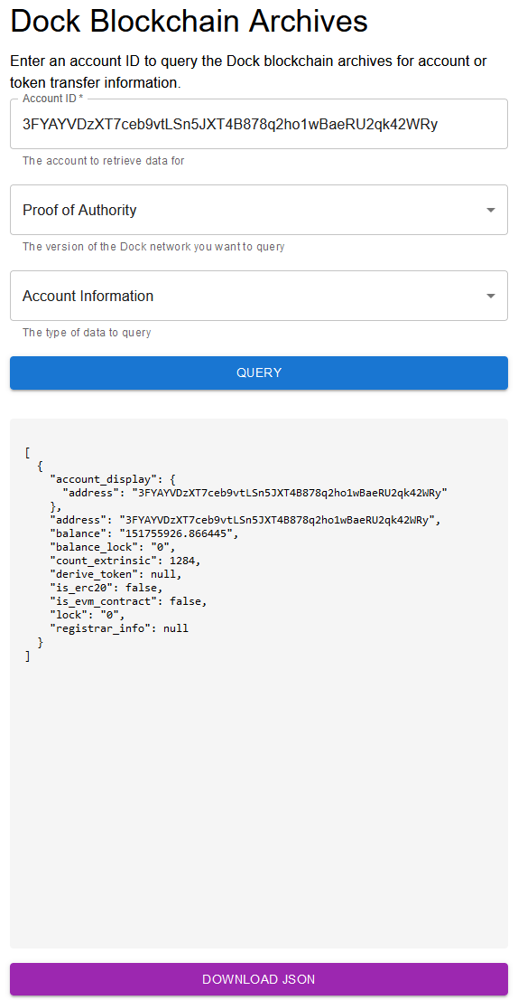

# Blockchain archives

With the migration from the Dock blockchain over to the cheqd blockchain the legacy blockchain explorers have been discontinued. However, historical archives for `account` and `transfer` history can be found at [https://archives.dock.io](https://archives.dock.io).

## Archived Networks

1. ERC20 Token - see [Etherscan](https://etherscan.io/token/0xe5dada80aa6477e85d09747f2842f7993d0df71c) _(NOTE: migration from the ERC20 token to the Substrate based DOCK token began `December 2020`)_
2. Proof of Authority - the original Substrate PoA network _(NOTE: was retired in `July 2021` when the network switched over to the Proof of Stake consensus algorithm)_
3. Proof of Stake - see [Subscan](https://dock.subscan.io)

## Searching the Archives

1. Enter the `Account ID`
2. Select the network history to query (i.e. Proof of Authority)
3. Select the data to retrieve (`Account Information` or `Token Transfer Information`)
4. Click `Query`

## Archive Results

If any matching data is found it will be displayed in the pane at the bottom of the page in `JSON` format.

## Downloading Results

1. Click on the `Download JSON` button below the results pane to download the results to your machine.
