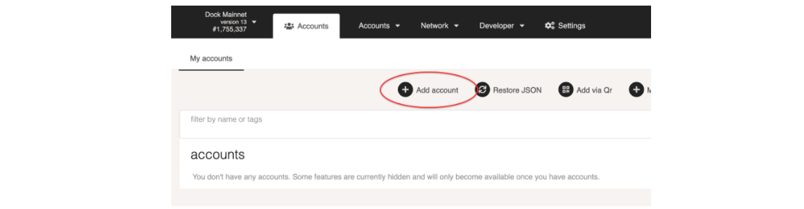
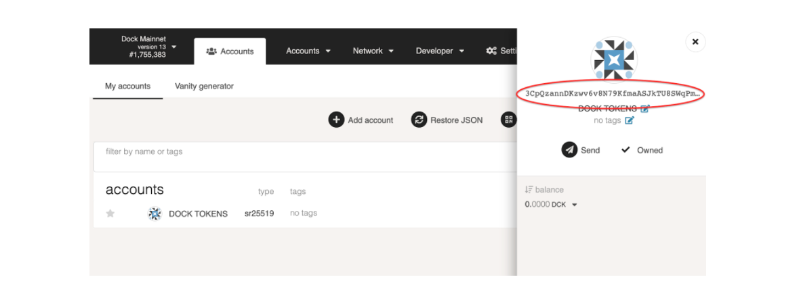
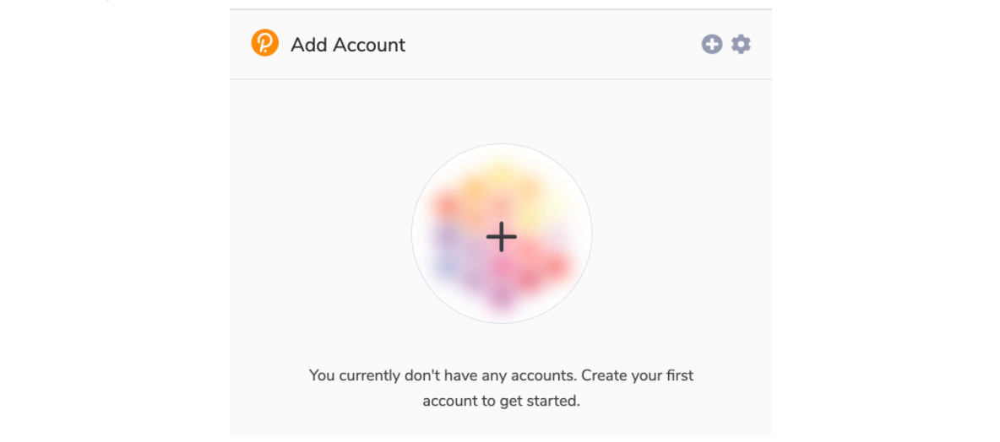
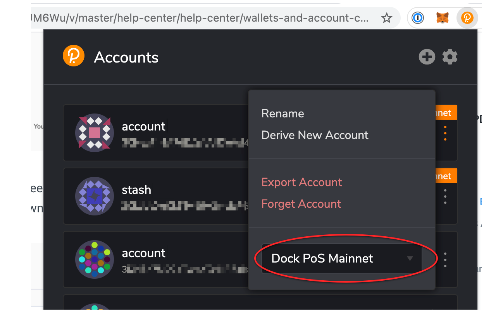
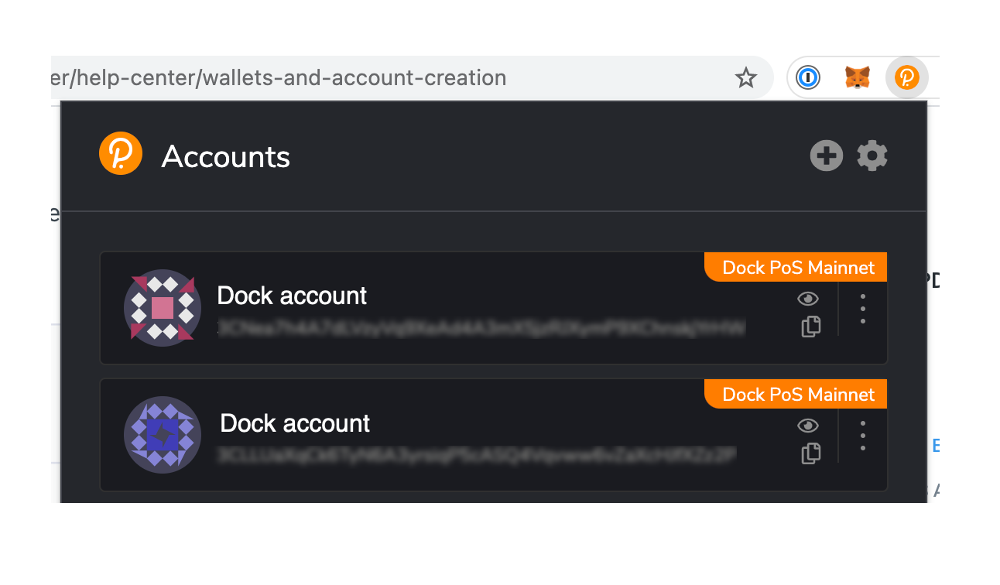

# How to store DOCK

DOCK token is supported by several wallets listed below.

## Dock Mobile Wallet App

Store, send, and receive your DOCK tokens securely on your mobile device using the Dock Mobile wallet app, available on both Android and iPhone. The Dock mobile wallet allows you to control and manage your own private keys and tokens on your device without the involvement of any third party.

Download the App from the [AppStore](https://apps.apple.com/us/app/dock-wallet/id1565227368) or Google [PlayStore](https://play.google.com/store/apps/details?id=com.dockapp).

## Nova Wallet App

‍[Nova Wallet](https://novawallet.io/) is a next-gen iOS/Android application for the Polkadot & Kusama ecosystem. Nova Wallet supports over 80+ networks and hundreds of assets, Governance, NFTs, extensive DApp support (for both Substrate & EVM), Hardware Wallet Support, Crowdloans, and staking of assets.

**Cold Storage:** Nova Wallet's Polkadot Vault integration provides enhanced security for your DOCK tokens. This feature turns your separate, unused mobile device into a hardware wallet. Your keys are kept secure (i.e. offline) at all times, and transactions are signed in an air-gapped way via QR-codes. [See instruction on how to set up Parity Signer with Nova Wallet](https://docs.novawallet.io/nova-wallet-wiki/wallet-management/hardware-wallets/parity-signer).

## Dock Polkadot-JS App

Dock has forked and customized the well-tested, browser-based wallet that is also used for Polkadot. This is a browser-based application, so it is not as secure as using an offline option.


Consider storing your account in a signer such as a browser extension, hardware device, QR-capable phone wallet (non-connected) or desktop application for optimal account security.


Go to [https://fe.dock.io/#/accounts](https://fe.dock.io/#/accounts) and check the top left corner that you are on Dock’s mainnet. If not, then click on the network name, click on **Live Networks > Dock**, and click **Switch**.

<figure><figcaption></figcaption></figure>

### **To create a new account**

Click on **+ Add Account** and complete the name and password fields, then click Next and Save.

**Important:** save the mnemonic seed in a safe, offline place. This is required to restore access to your account.

<figure><figcaption></figcaption></figure>

### **To view your Dock token address**

Go to the Accounts page and click on the name of the account. Your token address will appear on the right side of the page.

<figure><figcaption></figcaption></figure>

## Polkadot Browser Extension

Polkadot provides browser extension that manages accounts and allows signing of transactions, it cannot be used for sending funds. The extension works alongside polkadot applications similar to Metamask’s browser extension for Ethereum. More information about the extension can be found [here](https://github.com/polkadot-js/extension).

1. Download the app for your browser via [Chrome web store](https://chrome.google.com/webstore/detail/polkadot%7Bjs%7D-extension/mopnmbcafieddcagagdcbnhejhlodfdd) or [Firefox add-ons](https://addons.mozilla.org/en-US/firefox/addon/polkadot-js-extension/).
2. Once the app is installed, go to the app in your browser and click the + icon to add your account, then follow the steps to set up your account.

**Important:** save the mnemonic seed in a safe, offline place. This is required to restore access to your account.

<figure><figcaption></figcaption></figure>

3\. Next click on the three dots next to your account and select Dock PoS Mainnet in the dropdown.

<figure><figcaption></figcaption></figure>

4\. Once setup is complete, you will be able to view your account address in the browser extension app.

<figure><figcaption></figcaption></figure>

## Ledger Nano S Hardware Wallet

Ledger’s hardware wallet provides a very secure solution for storing your tokens. If you are purchasing the hardware wallet, make sure to purchase directly from the Ledger’s [website](https://shop.ledger.com/products/ledger-nano-s) or [amazon store](https://smile.amazon.com/Ledger-Nano-Hardware-Bitcoin-Ethereum/dp/B07FY5R77T/).

To install the app, connect your Ledger device go to the **Manager** tab in your Ledger Live. It will ask you to confirm opening the manager on the device and you should allow it. Now search for Dock. You will see 2 apps, **Dock** and **Dock XL** where **Dock XL** is a bigger but more feature-rich app like supporting governance whereas **Dock** is a lighter app and supports basic features like transfer and staking. Install an appropriate app.\
Now you can follow [this user guide ](https://github.com/LedgerHQ/app-dock/blob/develop/docs/User%20guide.md)to use the app.
