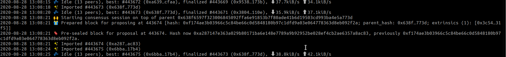

# Deployment

The code for the testnet and mainnet is located in the `testnet` and `mainnet` tags and of the [node repo](https://github.com/docknetwork/dock-substrate) respectively. The chain spec file for the testnet is [knox\_test\_raw](https://github.com/docknetwork/dock-substrate/blob/master/cspec/knox_test_raw.json?raw=true) and for the mainnet is [knox\_raw](https://raw.githubusercontent.com/docknetwork/dock-substrate/master/cspec/knox_raw.json). It should be passed to the `--chain` argument to the node while running the node. The chain spec has a bootnode hardcoded and thus specifying a bootnode is not needed\
There are 3 ways of deploying a node:

1. Building from source by cloning the Github repo and using cargo to build. Run the node by specifying the chain spec `knox_test_raw` (for testnet) or `knox_raw.json` (for mainnet) as `--chain=/cspec/knox_test_raw.json` or -`-chain=/cspec/knox_raw.json`.
2. Downloading the Docker image `docknetwork/dock-substrate:latest` for mainnet and `docknetwork/dock-substrate:testnet` for testnet from Dockerhub using command `docker pull docknetwork/dock-substrate:latest`. The image will accept all arguments as the node binary does. Specify the spec as `./cspec/knox_test_raw.json` or `/cspec/knox_raw.json` depending on whether running testnet or mainnet.
3. Using the Ansible playbook as described below. The playbook will download the appropriate Docker image, use appropriate chain spec and some other reasonable defaults described below.\
   &#xNAN;_&#x54;he playbook has only been tested with Ubuntu 18.04 and RHEL 8.2_. The playbook needs a machine provisioned and ssh access to it. It will set up Docker on that machine, download the node's image, and run a container with the given settings. It will use the appropriate chain spec. The playbook is run on a local machine (not the one that will be set up as node).\
   The playbook can be used to run 1 or more of the following:
   1. A full node, that can optionally serve RPC traffic from clients
   2. A validator node
   3. A sentry node

## Types of nodes

A **full node** is a node running Dock's core software. A full node can control who is allowed to connect to it and what it's allowed to do. Validators, sentry nodes, and bootstrap nodes are full nodes. A **validator node** processes transactions, produces and finalizes blocks, and earns rewards. Its public keys must be shared with the network so that its produced and finalized blocks can be verified by other nodes.

Since the validator's availability impacts the rewards, it's advised to protect it from DoS attacks. One step towards that is using one or more sentry nodes to communicate with other validators. A **sentry node** is a full node connected to the validator and filtering duplicate messages. A validator can have one or more sentry nodes with which it connects. The sentry nodes then connect to other validators and relay messages to the validator after filtering duplicate messages.

Any node can act as a boot node lets nodes discover other nodes in the network as a full node will know the libp2p addresses of all discoverable nodes in the network. A node can become a boot node by connecting to all nodes while enabling and maintaining connections from any other node. A sentry node can act as a boot node. A full node might decide to serve RPC traffic from clients. This full node might at the same time function as full node or sentry or validator. It is advised to run Nginx when serving clients and proxy RPC connections through it.

We _recommend_ having a 3 tiered deployment where the 1st tier which is a validator only talks to its sentry. The sentry node is the second tier and talks to the validator its responsible for and other whitelisted (reserved) nodes which might be sentries of other validators or other validators or some other full nodes serving clients or bootnodes. The nodes serving clients or acting as full nodes are the 3rd tier. The objective is to allow only whitelisted traffic (P2P or RPC) to tier 1 and 2 and only tier 3 allows client RPC traffic. A sentry most likely will have one full node dedicated to the serving RPC traffic from clients.

## Using the Ansible playbook to deploy a node

The playbook [run-node.yml](https://github.com/docknetwork/dock-substrate/blob/master/scripts/ansible/run-node.yml) has been tested on remotes running Ubuntu 18.04 and RHEL 8.2 with Ansible version 2.9.6 with python 3.8 and we recommend at least that version. It requires python3 to be installed on the host (where node will run) as well and sudo access to the remote. The playbook will accept the hostname and access credentials of the machine and deploy a full node on the machine and in a Docker container with the node data in a docker volume called `chain-data`.\
The node listens at Substrate's default ports for various kinds of traffic, i.e. for libp2p traffic, port 30333, RPC through TCP at port 9933 and RPC through Websockets at port 9944 and these ports of the container are bound to the host at the same port numbers so make sure that at least port 30333 is open. Whether the node allows RPC traffic from external traffic, depends on the value of the playbook flag `allow_ext_rpc`.

\
The playbook accepts a few arguments like (for more upto date documentation, check the [Readme](https://github.com/docknetwork/dock-substrate/blob/master/scripts/ansible/README.md))

1. path to python interpreter on remote `ansible_python_interpreter`
2. node name as `node_name`
3. libp2p secret key as `libp2p_key`, if not provided, the node will generate a random key
4. whether to allow external RPC requests as `allow_ext_rpc`, defaults to false
5. whether the node is running as a validator or not as `is_validator`, defaults to false
6. if a node is a sentry of a validator as `sentry_of` , if not provided then ignored
7. whether will only connect to its reserved (whitelisted nodes) as `reserved_only`, defaults to false
8. its reserved nodes as an array `reserved_nodes`, defaults to empty array
9. if the node should use bootnodes or not as an array `bootnodes`, defaults to empty array
10. what telemetry url it should use as `telemetry_url` , default to no telemetry. To use Polkadot's telemetry, set it as `'wss://telemetry.polkadot.io/submit/ 0'`
11. if session key should be rotated, as `rotate_session_key`, defaults to false
12. pruning mode for the node, as `pruning`, this can be either `archive` or a positive integer.
13. `docker_image_tag` for the docker image tag to use, defaults to `latest`
14. `docker_container_name` for the docker container name, defaults to `dock-node`
15. `mount_container_at` for the mount point of the docker container's volume, defaults at `/docknode`

These arguments can be given from the command line or set in the hosts file. A [sample hosts file](https://github.com/docknetwork/dock-substrate/blob/master/scripts/ansible/hosts.sample) is provided showing these variables for validator, sentry and a full node. Note that the sample file has several placeholders enclosed in angle brackets, i.e. like `<validator node ip>` or `<path of private key file>` , all of these should be appropriately filled or removed else the hosts file won't be parsable.

### Examples using the playbook

The sample hosts file assumes password-less ssh access, but if you require an additional password, use the flag `-k` while running the playbook. If you are not using a private key but only a password, use `ansible_ssh_pass`.

**Deploy validator**

The validator is deployed assuming a host called `validator` defined in the `hosts` file with host variables similar to the ones in the sample hosts file

1.  The following will deploy a validator with name `MyValidator`, overide the libp2p key to be `0x2c0ac6d8f3eb6b51af3e67f851f8d72875f3c6a0612ce67fe1cfa6f0e46deb6b` , rotate the session key and will allow connections from any node. The session key will be stored in a file called `session_key.txt` on the host. The `rotate_session_key` flag must be used the first time the node is being set up.

    ```
     ansible-playbook -i hosts poa-1-node.yml --extra-vars "host=validator node_name=MyValidator libp2p_key=2c0ac6d8f3eb6b51af3e67f851f8d72875f3c6a0612ce67fe1cfa6f0e46deb6b rotate_session_key=true reserved_only=false"
    ```
2.  The following will deploy a validator similar to above but will only allow connections from libp2p node `/ip4/35.155.248.216/tcp/30333/p2p/QmawgZD3BANiKR72ZXsSEEAMpz9iQkCy4r2RDyihQysuRm`. In practice, this will be the sentry. But note that value of `reserved_nodes` is an array so it can have any number of values, i.e. libp2p peer ids.

    ```
     ansible-playbook -s poa-1-node.yml --extra-vars "host=validator node_name=MyValidator libp2p_key=2c0ac6d8f3eb6b51af3e67f851f8d72875f3c6a0612ce67fe1cfa6f0e46deb6b reserved_nodes=['/ip4/35.155.248.216/tcp/30333/p2p/QmawgZD3BANiKR72ZXsSEEAMpz9iQkCy4r2RDyihQysuRm']"
    ```

**Deploy sentry**

_Note: Sentry nodes aren't supposed to give ultimate protection and are thus not required. Your validator may still be succesptible to denial of service attacks._\
\
The sentry is deployed assuming a host called `sentry` defined in the `hosts` file with host variables similar to the ones in the sample hosts file

1.  The following will deploy a sentry with name `MySentry`, the libp2p key `0x8d72875f3c6a0612ce67fe1cfa6f0e46deb6b2c0ac6d8f3eb6b51af3e67f851f` for the validator running at `/ip4/44.231.55.99/tcp/30333/p2p/QmaAARGgiUyGfqi87ZscaDRKknyw9jX9jJqsBwFi9jocYg`. The sentry node, however, allows connections from all nodes

    ```
     ansible-playbook -s poa-1-node.yml --extra-vars "host=sentry node_name=MySentry libp2p_key=8d72875f3c6a0612ce67fe1cfa6f0e46deb6b2c0ac6d8f3eb6b51af3e67f851f sentry_of=/ip4/44.231.55.99/tcp/30333/p2p/QmaAARGgiUyGfqi87ZscaDRKknyw9jX9jJqsBwFi9jocYg"
    ```
2.  The following will deploy a sentry similar to above but the sentry will only allow connection from 2 nodes, `/ip4/35.155.248.216/tcp/30333/p2p/QmawgZD3BANiKR72ZXsSEEAMpz9iQkCy4r2RDyihQysuRm` and `/ip4/54.218.195.100/tcp/30333/p2p/QmaWVer8pXKR8AM6u2B8r9gXivTW9vTitb6gjLM6FYQcXS`

    ```
     ansible-playbook -s poa-1-node.yml --extra-vars "host=sentry node_name=MySentry libp2p_key=8d72875f3c6a0612ce67fe1cfa6f0e46deb6b2c0ac6d8f3eb6b51af3e67f851f sentry_of=/ip4/44.231.55.99/tcp/30333/p2p/QmaAARGgiUyGfqi87ZscaDRKknyw9jX9jJqsBwFi9jocYg reserved_nodes=['/ip4/35.155.248.216/tcp/30333/p2p/QmawgZD3BANiKR72ZXsSEEAMpz9iQkCy4r2RDyihQysuRm', '/ip4/54.218.195.100/tcp/30333/p2p/QmaWVer8pXKR8AM6u2B8r9gXivTW9vTitb6gjLM6FYQcXS']"
    ```
3. Similar to the validator, the sentry node can use the flag `allow_ext_rpc` to allow/disallow RPC connections from outside.

**Deploy full node**

A full node is deployed similar to the sentry node but it allows connections from all.

1.  The following will deploy a full node with name `MyFullNode`, the libp2p key `0x8d72875f3c6a0612ce67fe1cfa6f0e46deb6b2c0ac6d8f3eb6b51af3e67f851f` . The full node, however, allows connections from all nodes

    ```
     ansible-playbook -s poa-1-node.yml --extra-vars "host=fullnode node_name=MyFullnode libp2p-key=8d72875f3c6a0612ce67fe1cfa6f0e46deb6b2c0ac6d8f3eb6b51af3e67f851f"
    ```
2. Similar to the validator and sentry, the full node can use the flag `allow_ext_rpc` to allow/disallow RPC connections from outside.

## Logs

Once a node has become a validator, it will periodically see logs like `Starting consensus session on top of parent...` , `Prepared block for proposing at ...` and `Pre-sealed block for proposal at` . These logs indicate that a node produced a block

<figure><figcaption></figcaption></figure>

If running using ansible, use command `sudo docker logs dock-node -f --tail 100` to see logs. Here `dock-node` is the name of the docker container Ansible creates and flag `-f` will keep on showing new logs as they are produced.

## Validator running with backup nodes

As validator rewards are proportional to their availability, it is important that validators maximize their node's uptime and thus maximize block production. But occasionally, a validator may have to taken down in case of necessary hardware or software upgrades or other reasons. Thus it is advised to run multiple nodes that are capable of becoming validators but only one running as a validator at an instant such tht .when an actual validator falls, another node can take over in its place.

This is achieved by running those nodes with the same session key but **only one** node is running with the `--validator` flag . Note that it is important that only 1 node is a validator else the validator will be penalized. To have several nodes running with the same session key, follow the instructions in [this section](broken-reference/) in the Key generation section for each backup node (including current validator). Then either set the session key yourself by making an extrinsic or share with us. We repeat, only one node should be running as a validator, i.e. with the `--validator` flag, rest should be running without that.

Once the nodes are running and the current validator has to be taken down, stop the validator node and restart one of the backup nodes with the `--validator` flag.

## Serving RPC traffic

It is advised to serve RPC traffic through a proxy like Nginx so that rate-limiting and similar protections can be used. As we anticipate that most nodes will be exposing Websocket RPC, some sample configuration for Nginx is specified. However, the following are not sufficient and a node runner should have firewall and other layers of protection as well.

### Proxying websocket connections through Nginx

Assuming the node is exposing websocket RPC at port 9944 and you want to listen for websocket connections at `/` (root) location, put the following inside the `server` section of Nginx config

```
server {
    ...
    .....
    ........
    location / {
        # Node's websocket RPC server is running at 9944
		    proxy_pass http://127.0.0.1:9944;
        proxy_http_version 1.1;
        proxy_set_header Upgrade $http_upgrade;
        proxy_set_header Connection "upgrade";
        proxy_set_header Host $host;
    }
}
```

On RedHat/Centos machines, you might have trouble making Nginx communicate with Node's WS RPC server due to which you will see Nginx sending HTTP 502 to clients or Nginx error logs like `connect() to 127.0.0.1:9944 failed (13: Permission denied) while connecting to upstream`. You need to make SELinux allow that communication by turning on this switch `httpd_can_network_connect` as `sudo setsebool -P httpd_can_network_connect 1`

### Limiting connections per IP

To limit the number of websocket connections that can be made from an IP, Nginx's `limit_conn` directive can be used as below. The example below restricts an IP to have only 5 connections at a time, any more connections will be rejected. Note that the connection zone `addr` is declared outside of a `server` block. Also note that this alone is not sufficient to stop a DoS attack as an attacker can get lots of machines (or NICs) or compromise other devices.

```
# Declare a connection zone "addr" and specify 20 megs of memory will be to store IPs
limit_conn_zone $binary_remote_addr zone=addr:20m;

...
...

server {
    .....
    .....
    
    # Allow only 5 connections from an IP
    limit_conn addr 5;
    
    location / {
        # Node's websocket RPC server is running at 9944
		    proxy_pass http://127.0.0.1:9944;
		    ......
		    .......
		}
}
```

### Limiting bandwidth per connection

To limit bandwidth per connection, you can use the `limit_rate` and optionally the `limit_rate_after` directive as well. The example config below shows that for each connection, after serving 10 kilobytes, its bandwidth is limited to 5 kilobytes/second.

```
server {
    .....
    .....
    
    # Allow only ....
    limit_conn .....;
    
    location / {
        # Node's websocket RPC server is running at 9944
		    proxy_pass http://127.0.0.1:9944;
		    ......
		    .......
		    
		    # Serve first 10 KB without any limit. After that limit to 5 KB/s
		    limit_rate_after 10k;
        limit_rate       5k;
		}
}
```
