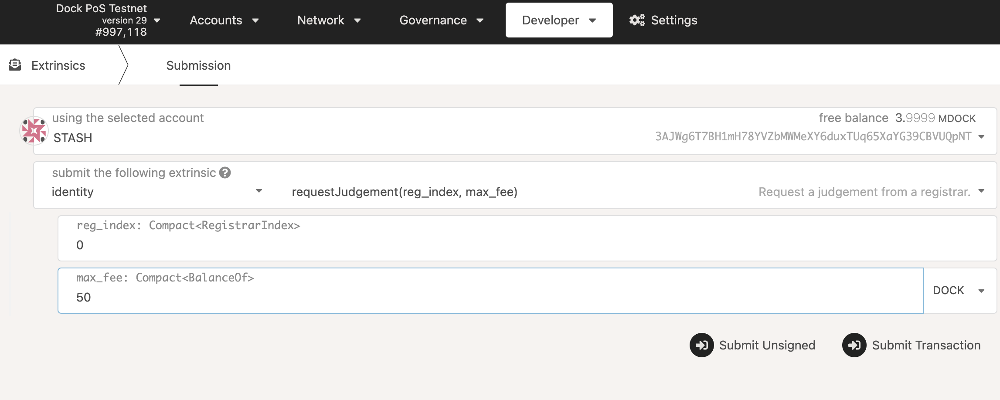

# Identity verification

After updating your identity on the Dock blockchain, you can verify your on-chain identity by submitting a request, called a judgement, to the Dock registrar. This is highly recommend for validators to gain credibility in the network. The identity fields that can be submitted for judgement include legal name, email, website, Twitter handle and Riot handle. Once verified, your account name will show a green check mark next to it.

<figure><figcaption></figcaption></figure>

### How to submit a request for identity verification

Prior to submitting a judgement, you will need to complete your identity setup by following the steps [here](https://docs.dock.io/validators/identity-setup).

Once your identity details are added on-chain, go to the [Extrinsics UI](https://fe.dock.io/#/extrinsics) and select the identity pallet, then requestJudgement. For the reg\_index put the index of the registrar you want to be judged by, which is "0" for the Dock registrar, and for the max\_fee put the maximum you're willing to pay for these confirmations.

There is currently one Registrar provided by Dock: `account: 3EpgfUS2x744ZTFccNdkpRRSW1efbYyqNyw81x9eHqy7JuAS`

`fee: 50 DOCK`

`reg_index: 0`

<figure><figcaption></figcaption></figure>

2\. Submit the transaction and contact our team at **support@dock.io** with the subject "Registrar Judgement" and include your account address in the email. Our team will be in touch with steps to verify your identity.

3\. The Dock team will submit the judgement to the Dock network and you will see a green check mark next to your account confirming that your information has been verified by the registrar.

###
