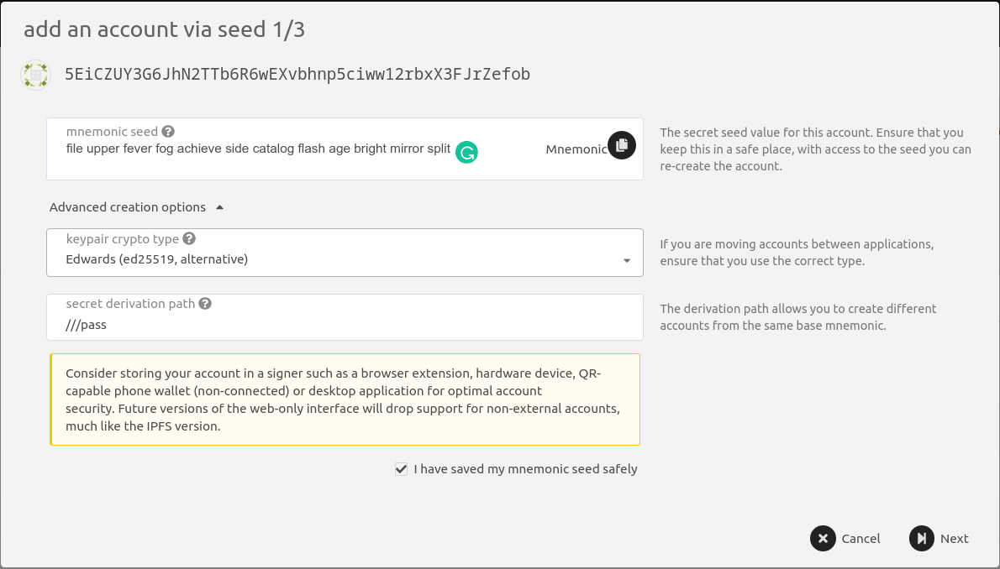
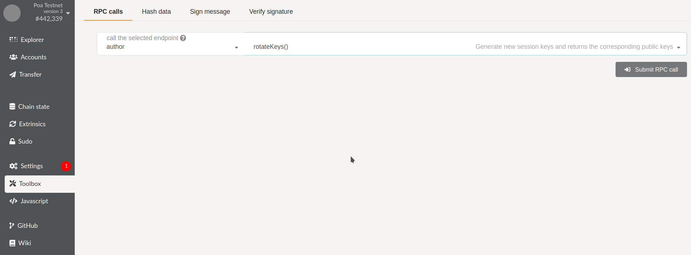
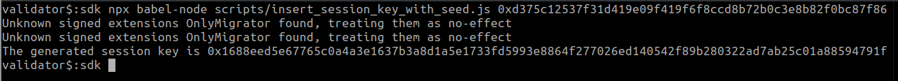
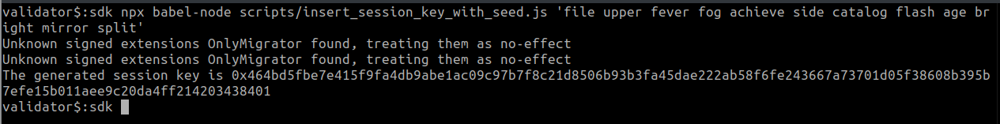

# Another Test of Integration
This should be removed.

# Key generation

There are two scripts provided, one to generate account (and associated keypair) and libp2p keypair and the other to rotate the session key of a running node and return the new key. A candidate validator is expected to generate his account and _optionally_ a libp2p keypair with the first script and then run his node _optionally_ with the libp2p key and then run the second script to rotate his session key and then share the account address and session key with Dock before his node can be made a validator. \
Generating the libp2p key is optional and only needed when the node needs to be whitelisted and the peer id needs to be communicated to other nodes using the _reserved_ (`--reserved-only` or `--reserved-nodes`) feature. Even then the running node can be inspected for its libp2p key but that's a bit of work. We ask for libp2p peer IDs of validators as we might run our validators with the reserved flags.

The session key represents a pair of public keys, its the concatenation of Aura and Grandpa public keys (as we are a proof of Authority for now). You can generate new session keys with the script or the UI and that results in the creation of 2 new keypairs, inserting the corresponding private keys in the node's keystore and returning the concatenated public keys as the session key.

## Generating account and libp2p key

### Using script

The script [gen\_keys\_poa\_validator](https://github.com/docknetwork/dock-substrate/blob/master/scripts/gen\_keys\_poa\_validator) is used to generate account and libp2p keypair and is present in the Substrate node's [scripts](https://github.com/docknetwork/dock-substrate/tree/poa-1/scripts) directory. This script internally uses [subkey](https://substrate.dev/docs/en/knowledgebase/integrate/subkey) and requires it to be installed. It requires 2 mandatory arguments, i.e. the account type and an account password and 1 optional argument for the network, which defaults to mainnet.

* The account type can have one of the three values: `ed25519`, `sr25519` and `ecdsa` to generate the type of account private key.
* The account password is used to protect the account secret phrase.
* The network on which the address is used, possible values and `main` and `test` and defaults to `main`

It generates the following:

1. An account address.
2. The account's private key.
3. The secret phrase for the account, this phrase is protected by the password.
4. The libp2p public key.
5. The libp2p secret key.
6. The name of the file containing the libp2p secret key.

**Example run of the script**

Generate an `ed25519` account with password `pass` to generate account and libp2p keys respectively. The secret information is displayed in red. In place of `ed25519`, `sr25519` and `ecdsa` can be used as well.

```
$ ./scripts/gen_keys_poa_validator ed25519 pass test
The account address in ss58 format is 5EiCZUY3G6JhN2TTb6R6wEXvbhnp5ciww12rbxX3FJrZefob
The secret phrase for the account is file upper fever fog achieve side catalog flash age bright mirror split
The secret key for the account is 0x67826291fd8ce9941e19e2e0d97ad16cd467f40aee9c29898570f9b28645d7c2
The libp2p public key is 12D3KooWSYpVtTUNoFEgRTZHia4CZqb1GN4GdnL4ZfUEAkFdkhWa
The libp2p secret key is d375c12537f31d419e09f419f6f8ccd8b72b0c3e8b82f0bc87f869a17c3ad1ec
The libp2p secret key is also stored in the file lib-p2p-secret.key
```

Clear your bash history and console buffer once you have noted the above information elsewhere.

### Using browser UI

If you do not wish to generate the libp2p key and do not want to use the script, you can generate the account by going to our UI [here](https://fe.dock.io/#/accounts) and clicking on **Add Account**. Then share the address with us.

The browser UI can be used to restore the account generated with the script above by entering the secret phrase and password. Something that's not obvious is the password given to the script should go in the derivation path. Below is a screenshot of how the secret phrase generated in the above script is restored

<figure><figcaption></figcaption></figure>

## Generating session key

### Using curl from the command line

Log into the machine running the node. If you are running a docker container, ssh into the container with `docker exec -it /bin/bash`. Now run the following curl command to send the RPC call to the node (assuming node is running at  localhost:9933)

```
$ curl http://localhost:9933 -H "Content-Type:application/json;charset=utf-8" -d \
    '{
        "jsonrpc":"2.0",
        "id":1,
        "method":"author_rotateKeys",
        "params":[]
    }'

```

The above command will generate new keypairs, insert them into your keystore and output the session key (which is a concatenation of public keys).&#x20;

### Using script

The script [rotate\_session\_key](https://github.com/docknetwork/dock-substrate/blob/master/scripts/rotate\_session\_key) is used to generate a new session key, which is a pair of public keys, of a running node, insert the corresponding private keys in the node's keystore, and return the session key.  It optionally accepts an argument of the node's RPC endpoint and if not given, assumes the node running at http://localhost:9933.&#x20;

**Example run of the script**

Rotate the session key of a running node. The following run assumes the node is running at http://localhost:9933.

```
 $ ./scripts/rotate_session_key
 The session key is 0xd4a23d286b25aa8ee401acf2ac10232047b40905c327c3dd9ab5442cb9539663b1bb339873b201d3995c88bb1e8f6983878be18ae65abce4cc41ef0de01fa8ae
```

If the validator wishes to change their account or session, they can run the above scripts again and submit the new account and/or the session keys.

### Using browser UI

If you do not wish to use the script, you can connect our UI to your node and point it to your node by going [here](https://fe.dock.io/#/settings) and add your node details by editing the "_remote node/endpoint to connect to_" dropdown and enabling "_custom endpoint_". Note that your node must be running with `--rpc-cors=all` flag for this to work. Once the UI has connected to the node, RPC call `rotateKeys` must be made by going [here](https://fe.dock.io/#/toolbox), and submitting the RPC call shown in the image.

<figure><figcaption></figcaption></figure>

### Inserting session keys

To generate session keys deterministically and insert them to the node's keystore (which is needed when using running validators with backups as explained [here](broken-reference) in the Deployment section), you need to run the node.js script  `insert_session_key_with_seed.js` from [here](https://github.com/docknetwork/sdk/blob/poa-1/scripts/insert\_session\_key\_with\_seed.js) on the machine running the node as the script makes an unsafe RPC call. The script assumes an environment variable `FullNodeEndpoint` to be set which contains the websocket endpoint of the node and takes 1 argument which is the seed used to generate the session key (session key is a pair of Aura and Grandpa public keys and we use the same seed to generate both the keys). The seed can be a 32 byte hex or a secret phrase.&#x20;

**Example runs of the script**

<figure><figcaption></figcaption></figure>

<figure><figcaption></figcaption></figure>
