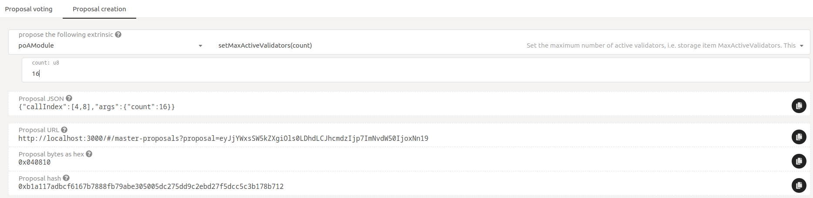
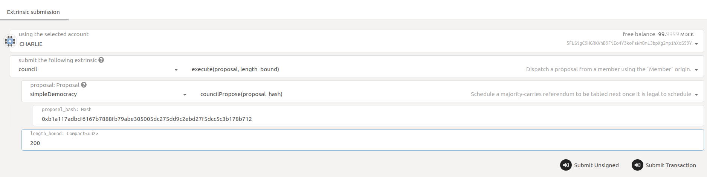
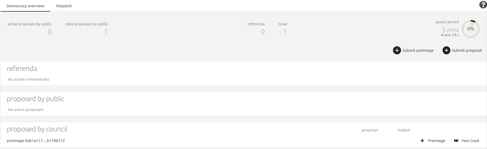
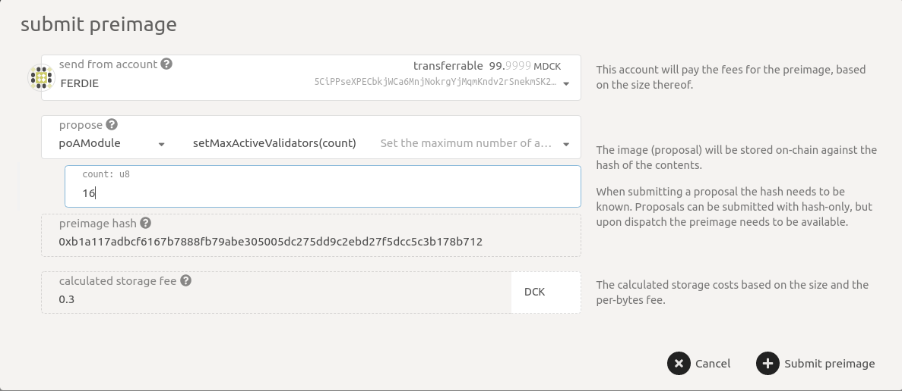
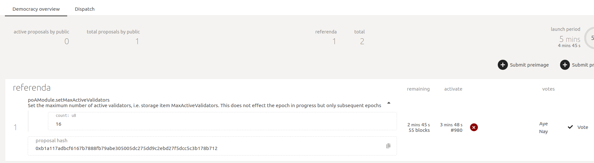
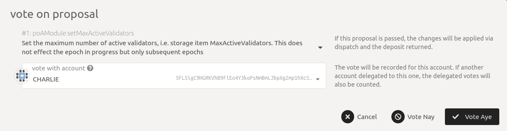
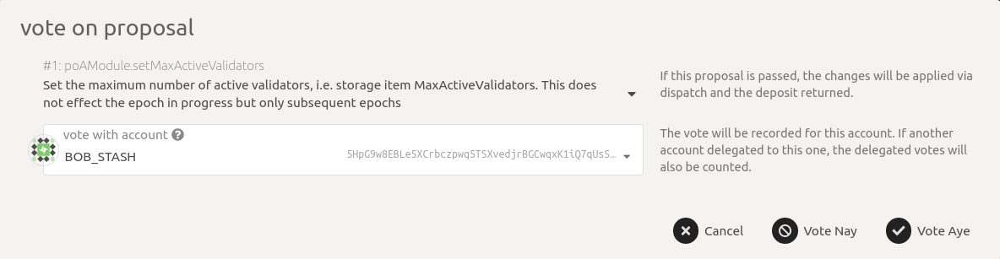
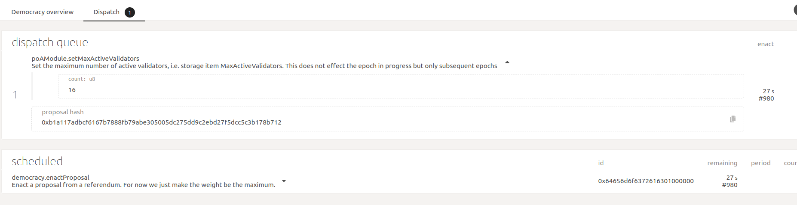
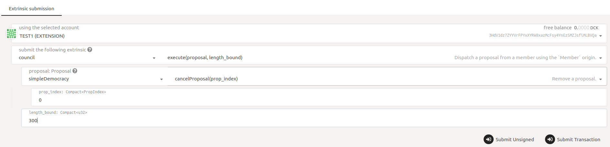

# Council Proposals

### Preparing a proposal

To create a proposal, we need to know its hash. For that navigate to [https://fe.dock.io/#/master-proposals/create](https://fe.dock.io/#/master-proposals/create). Now select the change you want to propose and note down the "Proposal hash". The image below shows a proposal being created to increase the maximum allowed validators to be 16. You can ignore the proposal URL.

<figure><figcaption></figcaption></figure>

### Submitting a proposal

To submit a proposal as a Council member, go to the "Extrinsics" page here [https://fe.dock.io/#/extrinsics](https://fe.dock.io/#/extrinsics) and send an `execute` call through the `council` pallet. The `execute` call with execute the `councilPropose` call of `simpleDemocracy` pallet with the proposal hash created above. The `length_bound` can be set to 200. The image below shows Charlie who is a Council member sending such a call. This call can only be successfully sent by a Council member.

<figure><figcaption></figcaption></figure>

Once you have executed this call, the proposal can be seen on the Democracy page here [https://fe.dock.io/#/democracy](https://fe.dock.io/#/democracy) under "proposed by council". An example below

<figure><figcaption></figcaption></figure>

Note that the above entry does not yet say what the proposal is, it only shows the hash. This is because the chain only knows the hash or the "image" of the proposal. To submit the actual proposal ("preimage") to the chain, click on **Preimage** button and enter the same proposal to submit as the preimage. The preimage can be submitted by anybody and does not have to be submitted by the original proposer. In the example below, note that "Ferdie" is submitting the preimage where Charlie had created the proposal (see above)

<figure><figcaption></figcaption></figure>

### Becoming a referendum

Once sufficient time has passed (shown under "launch period" on the page), the proposal becomes a referendum and is now ready to be voted upon by the Council. The image below shows how the proposal has moved under "referenda". It also shows the expiry of the referendum under "remaining" and also that note that no voting has yet been done on it. Also, the "1" is the referendum index and uniquely identifies the referendum.

<figure><figcaption></figcaption></figure>

### Voting

Now the Council members can vote on the referendum by clicking on **Vote**. The images below show that both Charlie and Bob\_Stash approve the referendum by clicking on **Vote Aye** and submitting the transaction. Note that they are voting on referendum index 1.

<figure><figcaption></figcaption></figure>

<figure><figcaption></figcaption></figure>

### Execution

Once the voting period has passed, the accepted referendum moves to the dispatch queue where it will be executed after some time. You can see the time remaining to execute under enact. Here also, the "0" specifies the referendum index.

<figure><figcaption></figcaption></figure>

**Note:** The time to launch referendum, do voting, enact passed referendum, etc have been shown in minutes and seconds according to the example images but in practice, these will be on the order of days.

### Canceling a proposal

Any Council member can cancel a proposal from the public unilaterally, thus slashing the locked deposit of the proposer and any others who have seconded that proposal. The slashed deposits go to the treasury. Council members are supposed to act responsibly and only cancel proposals that are definitely spam and meant to only waste one "launch period". A council member can submit such the `cancelProposal` by specifying the proposal index from here [https://fe.dock.io/#/extrinsics](https://fe.dock.io/#/extrinsics). The example below shows council member "TEST1" canceling the proposal with index 0.

<figure><figcaption></figcaption></figure>
