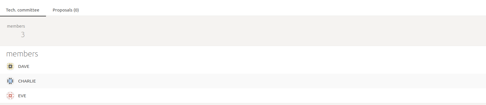
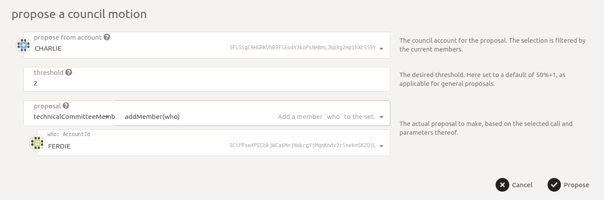
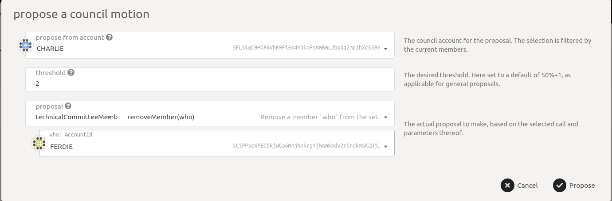

# Technical Committee

The technical committee can fast track governance proposals made by the Council. The current technical committee members can be seen at the URL [https://fe.dock.io/#/techcomm](https://fe.dock.io/#/techcomm). The image shows 3 technical committee members Dave, Eve, and Ferdie. Note that the images are for illustrative purposes and the name, address, member count might not match the network.

<figure><figcaption></figcaption></figure>

Council members can add new or remove existing technical committee members through simple majority voting, in the same way they do for Council members with a slight but important difference (described below). To look at the process, visit the Council section.

<figure><figcaption></figcaption></figure>

The rest of the process is the same as adding a member to the Council with the "Propose" -> "Vote" -> "Close" workflow.

The process to remove a member is similar, the image below shows Ferdie being removed from the committee.

<figure><figcaption></figcaption></figure>
