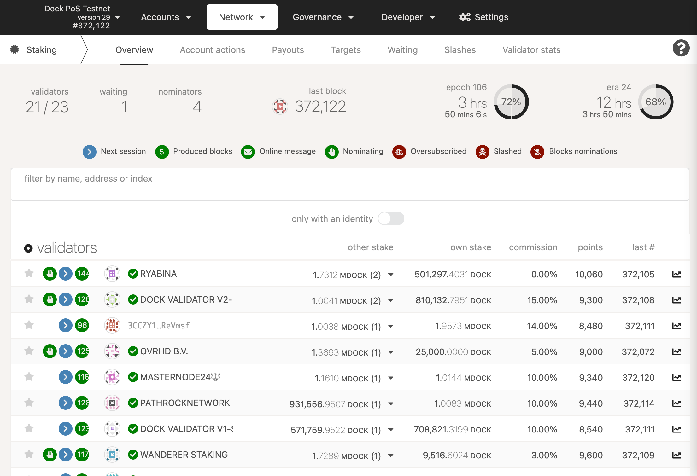

# Staking process

Token holders can help to secure the Dock blockchain and earn passive income by selecting validators, staking DOCK tokens on their behalf and sharing in the staking rewards.

### **Staking process**

A new set of validators is selected for each era, which is a duration of 12 hours, and the set of validators is selected 2 eras before. For example, validators running in era 10 were elected in era 8. Parameters set for each validator including the stake amount, the validator's commission rate, etc, are fixed as well during the selection. For example, if a validator changes the commission from 10% to 20% in era 10, the 20% commission won't take effect until era 12. This is also true for stakers when they select validators. If a staker nominates validators _A_, _B_, and _C_ in era 10, the nominator's funds will be locked for staking in era 10, but they will count toward validators _A_, _B_, and _C_ in era 12. While staking, the staked tokens are locked (bonded) and there is a 7 day period before staked funds can be transferred.

**Oversubscribed Validators**

Validators can only pay out to a certain number of stakers per era. This is currently set to 256, but can be modified via governance. If more than 256 stakers nominate the same validator, it is considered ‘oversubscribed’, and only the top 256 stakers (ranked by amount of stake) are paid rewards. Other stakers will receive no rewards for that era, although their stake will still be used to calculate entry into the active validator set.

Although it is difficult to determine exactly how many stakers will nominate a given validator in the next era, an educated guess can be made based on the current number of stakers. A validator with only 5 stakers in this era, for instance, is unlikely to have more than 256 in the next era. An already-oversubscribed validator with 1000 stakers this era, however, is very likely to be oversubscribed in the next era as well.

**Elimination of Stakers**

Determining which validators are in the active set and which stakers are nominating them creates a very large graph mapping stakers to their respective validators. This "solution set" is computed off-chain and submitted to the chain, which means it must fit in a single block. Currently, stakers are sorted by amount of DOCK staked and those with more DOCK are prioritized. This means that if you are staking with a small amount of DOCK, you may not receive rewards. This minimal amount is dynamic based on the number of validators, number of stakers, amount staked, and other factors.\

**Receiving Rewards**

As long as you have nominated more than one validator candidate, and at least one of them got elected, and you are nominating with enough stake to get into the solution set, your bonded stake will be fully distributed to one or more validators. That being said, you may not receive rewards if you nominated validators who weren't selected, or if your stake is small and you only selected oversubscribed validators, or if the validator you are nominating has 100% commission. It is generally wise to choose as many trustworthy validators as you can (up to 16) to reduce the risk of none of your nominated validators being elected.

Rewards are lazy - somebody must trigger a payout for a validator for rewards to get all of the validator's nominators. Any account can do this, although in practice validator operators often do this as a service to their nominators. See the page on Simple Payouts for more information and instructions for claiming rewards.

**Considerations for Stakers**

One thing to keep in mind is the validator's commission. The commission is the percentage of the validator reward which is taken by the validator before the rewards are split among the nominators. As a staker, you may think that the lowest commission is best. However, this is not always true. Validators must be able to run at break-even in order to sustainably continue operation. Independent validators that rely on the commission to cover their server costs help to keep the network decentralized. Commission is just one piece of the puzzle that you should consider when picking validators to nominate.

<figure><figcaption></figcaption></figure>

As a staker, if you only want to know the profit each validator made for each era, you can go to the Targets section under the staking page by inputting the number of tokens you would like to stake to check it. Then, nominate those who have a higher profit. However, that does not guarantee the right way to evaluate the validators' overall performance.

Within the same page (Targets) you can filter prospective validators by the following traits to help narrow down your selection. The traits are:

* Single from operator - Do not show groups of validators run by a single operator.
* No 20%+ comm - Do not show any validators with a commission of 20% or higher.
* No at capacity - Do not show any validators who are currently operating at capacity (i.e. they could potentially be oversubscribed).
* Recent payouts - Only show validators that have recently caused a payout to be issued. Note that anyone can cause a payout to occur; it does not have to be the operator of a validator.
* Only elected - Only show validators that are currently in the active set (i.e., they have been elected to produce blocks this era).
* Only with an identity - Only show validators that have set an identity. Note that this identity does not have to be verified by a registrar for the validator to show up in the list.
