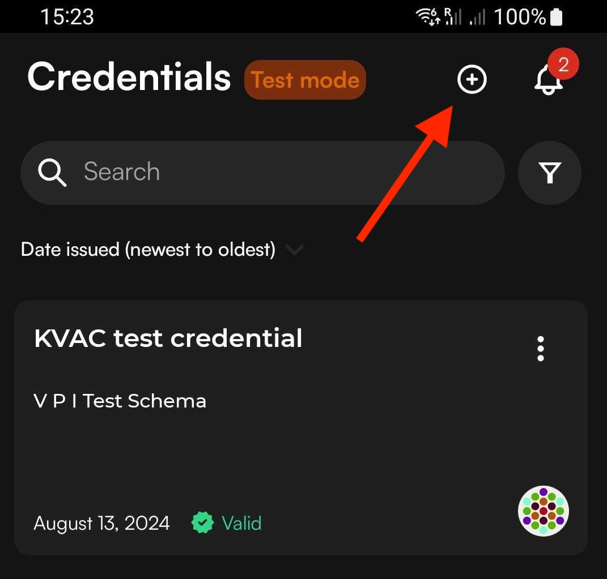

# Issue-Store-Verify sample flow

This flow refers to Postman, but the general steps are the same however you use the API. The Issue Store Verify collection includes the scripts that automatically propagate results into the next request bodies when you follow the below steps.&#x20;

Download the sample collection [here](../../Postman_collections/Issue-Store-Verify%20flow).

To issue a credential and or a presentation on the holder's behalf, the following steps are required:

## 1. Create a DID

To create a new DID to issue with, go to **Create DID** and click **Send**. The `id` property denotes a job ID in the system that you can use to query for blockchain transaction status.

The Truvera API supports `did:cheqd` and `did:key` method creation.

<details>

<summary>Body</summary>

```json
{
"type": "cheqd"
}
```

</details>

<details>

<summary>200 Response</summary>

```json
{
    "did": "did:cheqd:5CvswSAkWbyn6iQdRtMiD8tUAQmpXBghPVs9JqK5cJTiAhJk",
    "controller": "did:cheqd:5CvswSAkWbyn6iQdRtMiD8tUAQmpXBghPVs9JqK5cJTiAhJk",
    "id": "23677",
    "data": {
        "did": "did:cheqd:5CvswSAkWbyn6iQdRtMiD8tUAQmpXBghPVs9JqK5cJTiAhJk",
        "controller": "did:cheqd:5CvswSAkWbyn6iQdRtMiD8tUAQmpXBghPVs9JqK5cJTiAhJk"
    }
}
```

</details>


Creating a cheqd DID submits a transaction to the blockchain, this could take some time to process.&#x20;


## 2. Update the DID

To add information about your Organization to the DID, e.g. name and logo, you will need to update the DID profile.&#x20;

<details>

<summary>Body</summary>

```json
{
    "did":"did:cheqd:5CfsgqHioKCHNddVK9Y2Lu8fHQpvXh3nc9xVjLZNDqk1ZJ9z",
    "name": "Postman Test",
    "logo":""
}
```

</details>

<details>

<summary>200 Response</summary>

```json
{
    "did": "did:cheqd:5CfsgqHioKCHNddVK9Y2Lu8fHQpvXh3nc9xVjLZNDqk1ZJ9z",
    "name": "Postman Test",
    "logo": ""
}
```

</details>


You only need to create a DID once and then you can issue many credentials with it. A subject/holder DID should not be the same as the issuer DID in a real world credential.


## 3. Create a Schema

To issue a credential you will need to set a schema that will define which attributes need to be included in the credential.

<details>

<summary>Body</summary>

```json
{
      "$schema": "http://json-schema.org/schema",
      "name": "My Sample schema",
      "description": "description of my schema",
      "type": "object",
      "properties": {
        "id": {
          "type": "string"
        },
        "emailAddress": {
          "type": "string",
          "format": "email"
        },
        "textAttribute": {
          "type": "string"
        },
        "numberAttribute": {
          "type": "number"
        }
    },
      "required": [
        "emailAddress",
        "textAttribute",
        "numberAttribute"
      ],
      "additionalProperties": false
    }
```

</details>

<details>

<summary>200 Response</summary>

```json
{
    "id": "0",
    "data": {
        "schema": {
            "$schema": "http://json-schema.org/schema",
            "name": "My Sample schema",
            "description": "description of my schema",
            "type": "object",
            "properties": {
                "id": {
                    "type": "string"
                },
                "emailAddress": {
                    "type": "string",
                    "format": "email"
                },
                "textAttribute": {
                    "type": "string"
                },
                "numberAttribute": {
                    "type": "number"
                }
            },
            "required": [
                "emailAddress",
                "textAttribute",
                "numberAttribute"
            ],
            "additionalProperties": false,
            "$metadata": {
                "version": 1,
                "uris": {
                    "jsonSchema": "https://schema.truvera.io/MySampleSchema-V1-1737454702610.json",
                    "jsonLdContext": "https://schema.truvera.io/MySampleSchema-V1737454702610.json-ld"
                }
            },
            "$id": "https://schema.truvera.io/MySampleSchema-V1-1737454702610.json"
        },
        "id": "https://schema.truvera.io/MySampleSchema-V1-1737454702610.json",
        "uri": "https://schema.truvera.io/MySampleSchema-V1-1737454702610.json",
        "created": "2025-01-21T10:18:22.707Z",
        "isOwner": true,
        "ownerName": "",
        "ownerLogo": ""
    }
}
```

</details>

## 4. Issue a verifiable credential

To create a Verifiable Credential using the the new issuer DID, update Issuer with the DID you have created in the first step and add the required information to the attributes. It will return a Verifiable Credential that conforms to the W3C spec.

<details>

<summary>Body</summary>

````json
{
  "persist": true,
  "password": "1234",
  "algorithm": "dockbbs",
  "recipientEmail":"agne@truvera.io",
  "distribute": true,
  "format": "jsonld",
  "credential": {
    "name": "My test credential",
    "description": "describing my test credential",
    "schema": "https://schema.truvera.io/MySampleSchema-V1-1736946620866.json",
    "type": [
      "SampleSchema"
    ],
    "subject": {
        "id":"1234",
        "emailAddress":"myemail@address.com",
        "textAttribute":"Some text",
        "numberAttribute":1
    },
    "issuer": "did:cheqd:testnet:64b9e235-7267-4ca3-a643-8123292466c6",
    "issuanceDate": "2025-01-21T11:03:35.610Z"
  }
}
```
````

</details>

<details>

<summary>200 Response</summary>

```json
{
    "@context": [
        "https://www.w3.org/2018/credentials/v1",
        "https://ld.dock.io/credentials/extensions-v1",
        "https://ld.dock.io/security/bbs23/v1",
        "https://schema.truvera.io/MySampleSchema-V1736946620866.json-ld"
    ],
    "id": "https://creds-testnet.truvera.io/649587d77d648a56c9be7a43668a6c4c44dfa7eee6fbfd9188cbf293616457a3",
    "type": [
        "VerifiableCredential",
        "SampleSchema"
    ],
    "credentialSubject": {
        "id": "1234",
        "emailAddress": "myemail@address.com",
        "textAttribute": "Some text",
        "numberAttribute": 1
    },
    "issuanceDate": "2025-01-21T11:03:35.610Z",
    "issuer": {
        "name": "My new DID",
        "logo": "https://placehold.co/400",
        "id": "did:cheqd:testnet:64b9e235-7267-4ca3-a643-8123292466c6"
    },
    "credentialSchema": {
        "id": "https://schema.truvera.io/MySampleSchema-V1-1736946620866.json",
        "type": "JsonSchemaValidator2018",
        "details": "{\"jsonSchema\":{\"$id\":\"https://schema.truvera.io/MySampleSchema-V1-1736946620866.json\",\"$schema\":\"http://json-schema.org/schema\",\"description\":\"description of my schema\",\"name\":\"My Sample schema\",\"properties\":{\"@context\":{\"type\":\"string\"},\"credentialSchema\":{\"properties\":{\"details\":{\"type\":\"string\"},\"id\":{\"type\":\"string\"},\"type\":{\"type\":\"string\"},\"version\":{\"type\":\"string\"}},\"type\":\"object\"},\"credentialSubject\":{\"additionalProperties\":false,\"properties\":{\"emailAddress\":{\"format\":\"email\",\"type\":\"string\"},\"id\":{\"type\":\"string\"},\"numberAttribute\":{\"type\":\"number\"},\"textAttribute\":{\"type\":\"string\"}},\"required\":[\"emailAddress\",\"textAttribute\",\"numberAttribute\"],\"type\":\"object\"},\"cryptoVersion\":{\"type\":\"string\"},\"description\":{\"type\":\"string\"},\"id\":{\"type\":\"string\"},\"issuanceDate\":{\"format\":\"date-time\",\"type\":\"string\"},\"issuer\":{\"properties\":{\"id\":{\"type\":\"string\"},\"logo\":{\"type\":\"string\"},\"name\":{\"type\":\"string\"}},\"type\":\"object\"},\"name\":{\"type\":\"string\"},\"proof\":{\"properties\":{\"@context\":{\"items\":[{\"properties\":{\"proof\":{\"properties\":{\"@container\":{\"type\":\"string\"},\"@id\":{\"type\":\"string\"},\"@type\":{\"type\":\"string\"}},\"type\":\"object\"},\"sec\":{\"type\":\"string\"}},\"type\":\"object\"},{\"type\":\"string\"}],\"type\":\"array\"},\"created\":{\"format\":\"date-time\",\"type\":\"string\"},\"proofPurpose\":{\"type\":\"string\"},\"type\":{\"type\":\"string\"},\"verificationMethod\":{\"type\":\"string\"}},\"type\":\"object\"},\"type\":{\"type\":\"string\"}},\"type\":\"object\"},\"parsingOptions\":{\"defaultDecimalPlaces\":4,\"defaultMinimumDate\":-17592186044415,\"defaultMinimumInteger\":-4294967295,\"useDefaults\":true}}",
        "version": "0.4.0"
    },
    "name": "My test credential",
    "description": "describing my test credential",
    "cryptoVersion": "0.6.0",
    "proof": {
        "@context": [
            {
                "sec": "https://w3id.org/security#",
                "proof": {
                    "@id": "sec:proof",
                    "@type": "@id",
                    "@container": "@graph"
                }
            },
            "https://ld.dock.io/security/bbs23/v1"
        ],
        "type": "Bls12381BBSSignatureDock2023",
        "created": "2025-01-21T13:04:29Z",
        "verificationMethod": "did:cheqd:testnet:64b9e235-7267-4ca3-a643-8123292466c6#keys-2",
        "proofPurpose": "assertionMethod",
        "proofValue": "z2qWh3aNTysCYP8f41cj9jouGMHTKnag3vP4rfUJwXpQsnhjHgR6VfXYsj5TZAhNpG2jpkA4xTh1pDJjdsVgMdoXo8rdgAaNL5ovY36UqpsAC7V"
    }
}
```

</details>


## 5. Import the credential into the wallet

[Download Truvera wallet ](../../credential-wallet/download-truvera-wallet.md)and click on the email link that was sent when issuing the credential. If not using the email distribution download the json of the credential an import it to the wallet using the json import option.

<div align="left"><figure><figcaption></figcaption></figure></div>

## 5. Create a proof template

To verify a credential you will need a verification template, that will indicate which attributes need to be fulfilled for successful verification. Verification templates can be reused.

<details>

<summary>Body</summary>

```json
{
  "name": "My Sample Proof Template",
  "request": {
    "name": "sample proof template",
    "purpose": "test my sample proof template",
    "input_descriptors": [
      {
        "id": "Credential 1",
            "name": "Verify Sample credential",
            "purpose": "verify sample credential",
            "constraints": {
            "fields": [
                {
                "path": [
                    "$.credentialSubject.emailAddress"
                ],
                "optional": false
            },
            {
                "path": [
                    "$.credentialSubject.numberAttribute"
                ],
                "filter": {
                    "type": "number",
                    "exclusiveMinimum": 0
                },
                "optional": false,
                "predicate": "required"
            },
            {
                "path": [
                    "$.credentialSchema.id"
                ],
                "filter": {
                    "const": "https://schema.truvera.io/MySampleSchema-V1-1736946620866.json"
                }
            },
            {
                "path": [
                    "$.credentialSubject.textAttribute"
                ]
            }
          ]
        }
      }
    ]
  }
}
```

</details>

<details>

<summary>200 Response</summary>

```json
{
    "id": "6cc6abd6-d47e-46c4-9ba1-3677a904237b",
    "did": "",
    "name": "My Sample Proof Template",
    "created": "2025-01-21T13:05:50.319Z",
    "updated": "2025-01-21T13:05:50.319Z",
    "request": {
        "name": "sample proof template",
        "purpose": "test my sample proof template",
        "input_descriptors": [
            {
                "id": "Credential 1",
                "name": "Verify Sample credential",
                "purpose": "verify sample credential",
                "constraints": {
                    "fields": [
                        {
                            "path": [
                                "$.credentialSubject.emailAddress"
                            ],
                            "optional": false
                        },
                        {
                            "path": [
                                "$.credentialSubject.numberAttribute"
                            ],
                            "filter": {
                                "type": "number",
                                "exclusiveMinimum": 0
                            },
                            "optional": false,
                            "predicate": "required"
                        },
                        {
                            "path": [
                                "$.credentialSchema.id"
                            ],
                            "filter": {
                                "const": "https://schema.truvera.io/MySampleSchema-V1-1736946620866.json"
                            }
                        },
                        {
                            "path": [
                                "$.credentialSubject.textAttribute"
                            ]
                        }
                    ]
                }
            }
        ]
    },
    "totalRequests": 0,
    "types": [
        "jsonld"
    ]
}
```

</details>

## 6. Create a proof request

Using the verification template created in the previous step in the endpoint **POST/proof-templates/{id}/** request a single use proof request will be created.&#x20;

<details>

<summary>200 Response</summary>

```json
{
    "id": "86189366-c2a5-452e-b512-e052e26c84c1",
    "name": "My Sample Proof Template",
    "nonce": "6ef48e6c5f7a6f57eb92ab193f03fc8f",
    "did": "",
    "verified": false,
    "created": "2025-01-21T13:06:59.139Z",
    "updated": "2025-01-21T13:06:59.139Z",
    "signature": null,
    "presentation": {},
    "response_url": "https://api-testnet.truvera.io/proof-requests/86189366-c2a5-452e-b512-e052e26c84c1/send-presentation",
    "type": "proof-request",
    "qr": "https://creds-testnet.truvera.io/proof/86189366-c2a5-452e-b512-e052e26c84c1",
    "request": {
        "name": "sample proof template",
        "purpose": "test my sample proof template",
        "input_descriptors": [
            {
                "id": "Credential 1",
                "name": "Verify Sample credential",
                "purpose": "verify sample credential",
                "constraints": {
                    "fields": [
                        {
                            "path": [
                                "$.credentialSubject.emailAddress"
                            ],
                            "optional": false
                        },
                        {
                            "path": [
                                "$.credentialSubject.numberAttribute"
                            ],
                            "filter": {
                                "type": "number",
                                "exclusiveMinimum": 0
                            },
                            "optional": false,
                            "predicate": "required"
                        },
                        {
                            "path": [
                                "$.credentialSchema.id"
                            ],
                            "filter": {
                                "const": "https://schema.truvera.io/MySampleSchema-V1-1736946620866.json"
                            }
                        },
                        {
                            "path": [
                                "$.credentialSubject.textAttribute"
                            ]
                        }
                    ]
                }
            }
        ],
        "id": "86189366-c2a5-452e-b512-e052e26c84c1"
    },
    "types": [
        "jsonld"
    ]
}
```

</details>


The proof request is one time use so that the information from the credential can be associated to a specific transaction event. However, the proof template can be used as many times as needed.&#x20;

If there is a need to have a static QR code for multiple verification, a small service can be created to make proof requests from the verification template as and when needed.


## 7. Verify the Presentation

Scan the QR code from the proof presentation using your wallet to verify the credential.

